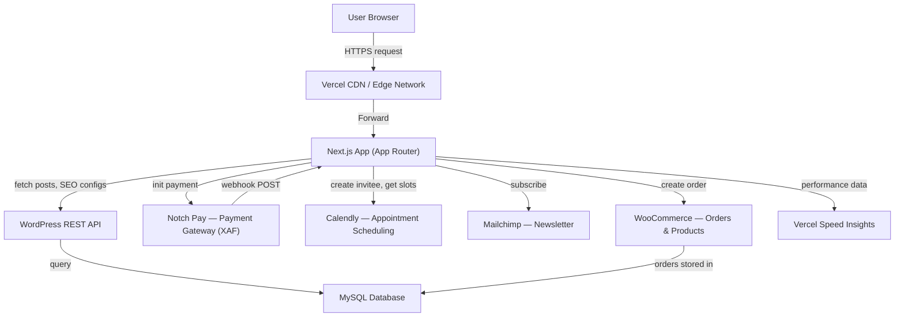
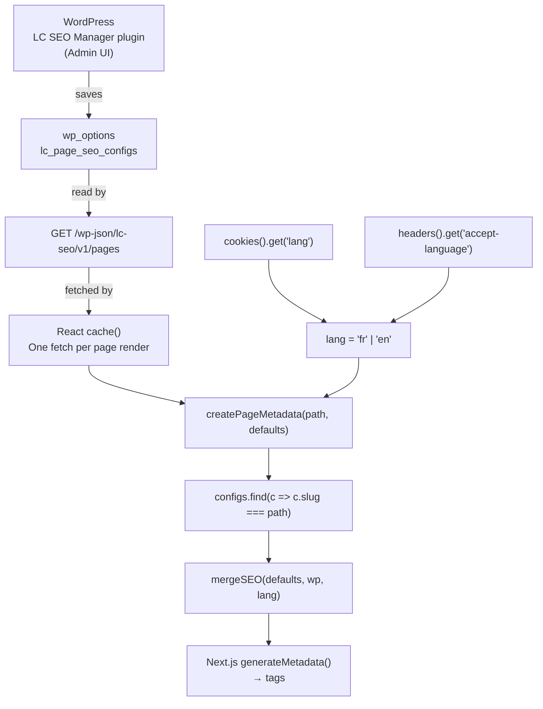
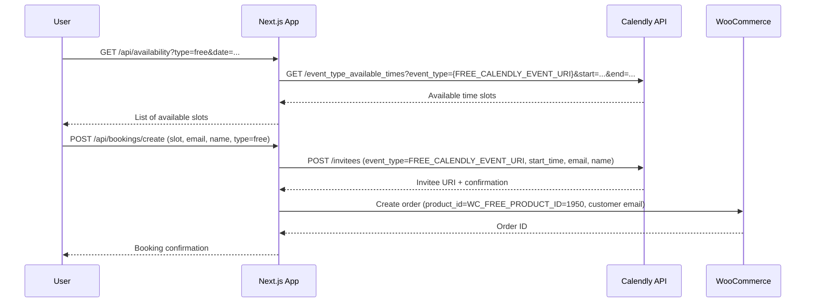
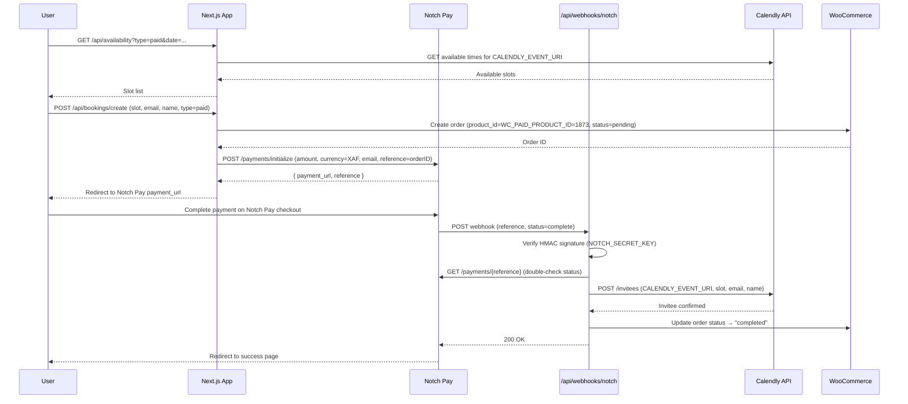

# Legal Cameroun — Operational Handbook

> **Version:** 1.1.0 · **Date:** 2026-03-10 · **Author:** RODEC Conseils / Legal Cameroun dev team

---

## Table of Contents

1. [Project Overview](#1-project-overview)
2. [Quick Start for New Operators](#2-quick-start-for-new-operators)
3. [Environments & Deployment](#3-environments--deployment)
   - 3.1 [Two environments explained](#31-two-environments-explained)
   - 3.2 [Vercel accounts & projects](#32-vercel-accounts--projects)
   - 3.3 [Domain configuration (SiteGround → Vercel)](#33-domain-configuration-siteground--vercel)
   - 3.4 [How to deploy](#34-how-to-deploy)
   - 3.5 [Local development setup](#35-local-development-setup)
4. [Third-Party Services — Configuration Reference](#4-third-party-services--configuration-reference)
   - 4.1 [WordPress (CMS)](#41-wordpress-cms)
   - 4.2 [WooCommerce (Orders)](#42-woocommerce-orders)
   - 4.3 [Calendly (Booking)](#43-calendly-booking)
   - 4.4 [Notch Pay (Payment)](#44-notch-pay-payment)
   - 4.5 [Mailchimp (Newsletter)](#45-mailchimp-newsletter)
   - 4.6 [Vercel (Hosting + Analytics)](#46-vercel-hosting--analytics)
5. [Environment Variables — Complete Reference](#5-environment-variables--complete-reference)
6. [SEO System](#6-seo-system)
   - 6.1 [How SEO metadata flows](#61-how-seo-metadata-flows)
   - 6.2 [Managing SEO via WordPress (LC SEO Manager)](#62-managing-seo-via-wordpress-lc-seo-manager)
   - 6.3 [Sitemap & robots](#63-sitemap--robots)
   - 6.4 [Blog post SEO](#64-blog-post-seo)
7. [Tax Simulator Algorithms](#7-tax-simulator-algorithms)
   - 7.1 [TVA (VAT)](#71-tva-vat)
   - 7.2 [IS (Corporate Tax)](#72-is-corporate-tax)
   - 7.3 [Salaire / Payroll](#73-salaire--payroll)
8. [Booking & Payment Flow](#8-booking--payment-flow)
   - 8.1 [Free consultation flow](#81-free-consultation-flow)
   - 8.2 [Paid consultation flow](#82-paid-consultation-flow)
   - 8.3 [Notch Pay webhook](#83-notch-pay-webhook)
   - 8.4 [WooCommerce order lifecycle](#84-woocommerce-order-lifecycle)
9. [Bilingual System (FR/EN)](#9-bilingual-system-fren)
10. [WordPress Integration](#10-wordpress-integration)
11. [WordPress Plugin — LC SEO Manager](#11-wordpress-plugin--lc-seo-manager)
12. [Site Administration Guide](#12-site-administration-guide)
13. [Tech Stack & Architecture](#13-tech-stack--architecture)
14. [All Routes & Pages](#14-all-routes--pages)
15. [Components Catalog](#15-components-catalog)
16. [Lib Utilities Reference](#16-lib-utilities-reference)
17. [Public Assets Reference](#17-public-assets-reference)

---

## 1. Project Overview

**Legal Cameroun** is a LegalTech platform for Cameroon, operated by **RODEC Conseils**. It is a bilingual (French/English) Next.js web application backed by a headless WordPress CMS.

### Key capabilities

| Capability | Description |
|---|---|
| Company creation | Guided flows for SAS, SARL, SARLU, Association |
| Company modification | Dissolution, head-office transfer, SARL↔SAS conversion |
| Expert consultation | Booking system (paid & free) via Calendly + WooCommerce |
| Tax calculators | TVA (VAT), IS (corporate tax), Salaire (salary/payroll) |
| Legal guides | Practical how-to articles (fiches pratiques) |
| Blog | Editorial content managed in WordPress, rendered via REST API |
| Quote/devis | Multi-step wizard for service quotation |
| Newsletter | Mailchimp subscription |

### System Architecture Overview



---

## 2. Quick Start for New Operators

This section tells you what to do first if you are new to this project.

### If you are a developer setting up locally

1. Clone the repo and run `npm install`
2. Copy `.env.example` to `.env.local`
3. Fill in the **development** values from Section 5 (use staging WordPress, test Notch Pay keys)
4. Run `npm run dev` — the site is at `http://localhost:3000`
5. To test the booking/payment webhook locally, install ngrok and set `NGROK_URL`

### If you are deploying to production

1. Open the **Legal Cameroun Vercel account** (not the personal michaelnde account)
2. Verify all environment variables in Vercel → Settings → Environment Variables match Section 5 (production column)
3. Push to `main` — Vercel auto-deploys
4. Confirm deployment at `https://www.legalcameroun.com`

### If you need to rotate a credential

| Credential | Where to update | What to do after |
|---|---|---|
| WordPress App Password | WP Admin → Users → Profile → Application Passwords | Update `WC_SITE_APP_PASSWORD` in Vercel; redeploy |
| WooCommerce keys | WP Admin → WooCommerce → Settings → Advanced → REST API | Update `WC_CONSUMER_KEY` + `WC_CONSUMER_SECRET` in Vercel; redeploy |
| Calendly PAT | Calendly → Integrations → API & Webhooks | Update `CALENDLY_PAT` in Vercel; redeploy |
| Calendly event URI | (changed when event type is edited/recreated) | Update `CALENDLY_EVENT_URI` or `FREE_CALENDLY_EVENT_URI` in Vercel; redeploy |
| Notch Pay keys | Notch Pay Business dashboard | Update `NOTCH_PUBLIC_KEY`, `NOTCH_PRIVATE_KEY`, `NOTCH_SECRET_KEY` in Vercel; redeploy |
| Mailchimp API key | Mailchimp → Account → API Keys | Update `MAILCHIMP_API_KEY` in Vercel; redeploy |

### Key dashboards

| Service | URL | Production account |
|---|---|---|
| WordPress Admin | `https://live.legalcameroun.com/wp-admin` | user: `legalcameroun` |
| Vercel | https://vercel.com | Legal Cameroun team |
| Notch Pay | https://business.notchpay.co | RODEC Conseils account |
| Calendly | https://calendly.com | RODEC Conseils account |
| Mailchimp | https://mailchimp.com | RODEC Conseils account |
| SiteGround (DNS) | https://my.siteground.com | Domain owner account |

---

## 3. Environments & Deployment

### 3.1 Two environments explained

The project has two distinct environments: **development** (used by the dev team locally) and **production** (the live site). They differ in WordPress instance, Vercel project, and API keys.

| Aspect | Development | Production |
|---|---|---|
| Frontend URL | `http://localhost:3000` | `https://www.legalcameroun.com` |
| WordPress URL | `https://staging.legalcameroun.com` | `https://live.legalcameroun.com` |
| WordPress username | `ndemikel@2025` | `legalcameroun` |
| Vercel account | Personal (michaelnde) | Legal Cameroun team account |
| Vercel config file | `.vercel.mike/project.json` | `.vercel/project.json` |
| Notch Pay mode | Test keys | Production keys |
| WooCommerce keys | Staging keys (`ck_657e491…`) | Production keys (`ck_3303a207…`) |
| Notch Pay webhook | ngrok tunnel URL | `https://www.legalcameroun.com/api/webhooks/notch` |

> **Why two WordPress instances?** The staging WordPress (`staging.legalcameroun.com`) lets you test content and plugin changes without affecting what users see. Production uses `live.legalcameroun.com`. Both use the same WooCommerce products by ID — if you create new products on staging, their IDs will differ from production.

### 3.2 Vercel accounts & projects

There are two Vercel configurations stored in this repository:

| Config path | Vercel account | Project ID | Org ID | Used for |
|---|---|---|---|---|
| `.vercel/project.json` | Legal Cameroun team | `prj_rPBGxzrquUAoSTCSZsYuafsGrYxV` | `team_Efd0zlD22K4i73jS0bb8BUku` | Production |
| `.vercel.mike/project.json` | Personal (michaelnde) | `prj_j5zCfOtFlalLAfRlVDJmiaoPLVsz` | `team_Nh4rhIeJxBOWWubPrWLFxbnl` | Development / testing |

**`.vercel/` is gitignored.** The production config is not stored in git — it is set up once on the production machine or CI. The `.vercel.mike/` directory *is* committed and is used by the dev when deploying to the personal Vercel project for testing.

To switch which Vercel project is active:

```bash
# Switch to Mike's (dev) project
cp -r .vercel.mike/ .vercel/

# Switch to production project (if you have saved it as .vercel.main/)
cp -r .vercel.main/ .vercel/
```

### 3.3 Domain configuration (SiteGround → Vercel)

The domain `legalcameroun.com` is registered and DNS-managed on **SiteGround**. DNS records point to Vercel's edge network:

| Record type | Name | Value | Purpose |
|---|---|---|---|
| A | `legalcameroun.com` | Vercel IP address | Apex domain → Vercel |
| CNAME | `www.legalcameroun.com` | `cname.vercel-dns.com` | www subdomain → Vercel |

Vercel then serves the Next.js application via its global CDN. SSL certificates are automatically managed by Vercel.

**If the domain stops working:**
1. Log in to SiteGround → DNS Zone Editor — verify A and CNAME records are still present
2. Log in to Vercel → Project → Settings → Domains — verify `legalcameroun.com` and `www.legalcameroun.com` are listed and show green "Valid"
3. DNS propagation can take up to 48 hours if records were recently changed

### 3.4 How to deploy

**Automatic (recommended):**
Push to the `main` branch. Vercel auto-deploys from `main` within ~2 minutes.

**Manual via Vercel dashboard:**
1. Open Vercel → Project → Deployments
2. Click **Redeploy** on the latest deployment
3. Use "Redeploy with existing build cache" for speed, or without cache if you changed dependencies

**Force ISR cache invalidation:**
WordPress content appears within 1 hour (ISR). To show new content immediately:
- Redeploy on Vercel (clears ISR cache), or
- Manually call Next.js revalidation endpoints if implemented

**Build command:** `npm run build`
**Node.js version:** 20.x

### 3.5 Local development setup

```bash
# 1. Install dependencies
npm install

# 2. Create local env file
cp .env.example .env.local
# Fill in development values (staging WordPress, test keys)

# 3. Start dev server
npm run dev
# Site available at http://localhost:3000

# 4. For webhook testing (Notch Pay)
ngrok http 3000
# Copy the https URL, set NGROK_URL=https://xxxx.ngrok.io in .env.local
# Set the same ngrok URL as webhook URL in Notch Pay test dashboard
```

---

## 4. Third-Party Services — Configuration Reference

### 4.1 WordPress (CMS)

**Role:** Headless CMS. Provides blog posts, SEO configuration (via custom plugin), legal page content, and form submission handling (Contact Form 7).

**Two instances:**

| Instance | URL | Admin user | Purpose |
|---|---|---|---|
| Staging | `https://staging.legalcameroun.com` | `ndemikel@2025` | Development & testing |
| Production | `https://live.legalcameroun.com` | `legalcameroun` | Live site content |

**Authentication method:** WordPress Application Passwords (not your login password).
- Generate at: **WP Admin → Users → Profile → Application Passwords**
- The application password is a separate token — rotating it does not affect login

**How the Next.js app authenticates:**
```
Authorization: Basic base64(WC_SITE_APP_USERNAME:WC_SITE_APP_PASSWORD)
```

**REST API base URL:** `{WC_SITE_URL}/wp-json/wp/v2`

**Troubleshooting:**
- Ensure `WC_SITE_URL` has no trailing slash
- Test with: `curl -H "Authorization: Basic <base64>" {WC_SITE_URL}/wp-json/wp/v2/posts`
- If REST API returns 401, the application password was regenerated — update `WC_SITE_APP_PASSWORD` in Vercel

---

### 4.2 WooCommerce (Orders)

**Role:** Order management for consultation bookings. Every booking — paid or free — creates a WooCommerce order. This gives RODEC Conseils a record of all consultations.

**Two product types, each with a fixed ID:**

| Product | Purpose | WooCommerce Product ID (prod) | Env var |
|---|---|---|---|
| Paid consultation | One-to-one paid expert consultation | **1873** | `WC_PAID_PRODUCT_ID` |
| Free consultation | Free introductory consultation | **1950** | `WC_FREE_PRODUCT_ID` |

> **Important:** These product IDs are specific to the **production** WooCommerce instance (`live.legalcameroun.com`). Staging IDs will differ. Always set the correct IDs in the correct environment's Vercel config.

**API keys:** WooCommerce uses its own consumer key/secret pair (separate from WordPress app passwords).
- Generate at: **WP Admin → WooCommerce → Settings → Advanced → REST API**
- Staging keys start with `ck_657e491…` / `cs_…`
- Production keys start with `ck_3303a207…` / `cs_…`

**Admin view for orders:** WP Admin → WooCommerce → Orders

---

### 4.3 Calendly (Booking)

**Role:** Appointment scheduling. Users pick available time slots; the app creates Calendly invitees via API.

**Two event types — this is critical to understand:**

| Event type | Description | Env var for URI | Linked WooCommerce product ID |
|---|---|---|---|
| Free consultation | No payment required; invitee created immediately | `FREE_CALENDLY_EVENT_URI` | **1950** |
| Paid consultation | Payment via Notch Pay required first; invitee created after payment | `CALENDLY_EVENT_URI` | **1873** |

**Authentication:** Personal Access Token (PAT)
- Generate at: Calendly → Account → Integrations → API & Webhooks → Personal Access Tokens
- Stored in `CALENDLY_PAT`
- PATs do not expire unless manually revoked

**Event URIs:** Full Calendly API URIs in the format `https://api.calendly.com/event_types/XXXXXXXX-XXXX-XXXX-XXXX-XXXXXXXXXXXX`
- Retrieve from the Calendly API: `GET https://api.calendly.com/event_types` (authenticated)
- **URIs change if you delete and recreate an event type** — always update env vars after doing so

**What the app does with Calendly:**
- `GET /api/availability` → calls Calendly to list available time slots for a given date range
- `POST /api/bookings/create` → creates a Calendly invitee (schedules the appointment)

**Admin view:** https://calendly.com/app/scheduled_events

---

### 4.4 Notch Pay (Payment)

**Role:** Payment gateway for the Cameroonian market. Handles payments in XAF (FCFA). Only used for **paid** consultations.

**Three keys — each has a distinct function:**

| Key | Env var | Function |
|---|---|---|
| Public key | `NOTCH_PUBLIC_KEY` | Initializes payment sessions (sent to client) |
| Private key | `NOTCH_PRIVATE_KEY` | Verifies payment status server-side |
| Webhook secret | `NOTCH_SECRET_KEY` | Validates webhook signature (HMAC) |

**Environments:**
- **Test mode:** Use test keys from Notch Pay dashboard → test payments with test card numbers
- **Production mode:** Switch to live keys; real money moves

**Webhook URL (production):** `https://www.legalcameroun.com/api/webhooks/notch`
- Must be configured in Notch Pay Business → Settings → Webhooks
- The `NOTCH_SECRET_KEY` in Vercel must match the secret shown in the Notch Pay webhook settings

**Admin dashboard:** https://business.notchpay.co

---

### 4.5 Mailchimp (Newsletter)

**Role:** Newsletter subscription list. Footer signup form subscribes users to a Mailchimp audience.

**Three values needed:**

| Value | Env var | Where to find it |
|---|---|---|
| API key | `MAILCHIMP_API_KEY` | Mailchimp → Account → Profile → Extras → API Keys |
| Audience ID | `MAILCHIMP_AUDIENCE_ID` | Mailchimp → Audience → All contacts → Settings → Audience ID |
| Server prefix | `MAILCHIMP_SERVER_PREFIX` | The subdomain in your Mailchimp URL, e.g., `us10` from `us10.admin.mailchimp.com` |

**Admin view:** https://mailchimp.com → Audience → All contacts

---

### 4.6 Vercel (Hosting + Analytics)

**Role:** Hosts the Next.js application. Handles CDN, serverless API routes, ISR cache, and automatic deploys from git.

**Speed Insights:** Enabled via `@vercel/speed-insights`. Tracks Core Web Vitals per page. View at Vercel Dashboard → Project → Analytics.

**Two Vercel projects:** See [Section 3.2](#32-vercel-accounts--projects) for full details.

---

## 5. Environment Variables — Complete Reference

Copy `.env.example` to `.env.local` for local development. All production values live in Vercel Dashboard → Settings → Environment Variables.

| Variable | Dev value | Prod value | Description |
|---|---|---|---|
| `WC_SITE_URL` | `https://staging.legalcameroun.com` | `https://live.legalcameroun.com` | WordPress root URL — no trailing slash |
| `WC_SITE_APP_USERNAME` | `ndemikel@2025` | `legalcameroun` | WordPress Application Password username |
| `WC_SITE_APP_PASSWORD` | *(staging app password)* | *(prod app password)* | WordPress Application Password value |
| `WP_REVALIDATE_SECONDS` | `60` (faster for dev) | `3600` | ISR cache TTL in seconds (1 hour default) |
| `WC_CONSUMER_KEY` | `ck_657e491…` | `ck_3303a207…` | WooCommerce REST API consumer key |
| `WC_CONSUMER_SECRET` | `cs_…` (staging) | `cs_…` (prod) | WooCommerce REST API consumer secret |
| `WC_PAID_PRODUCT_ID` | *(staging product ID)* | `1873` | WooCommerce product ID — paid consultation |
| `WC_FREE_PRODUCT_ID` | *(staging product ID)* | `1950` | WooCommerce product ID — free consultation |
| `CALENDLY_PAT` | *(test PAT)* | *(prod PAT)* | Calendly Personal Access Token |
| `CALENDLY_EVENT_URI` | *(test event URI)* | `https://api.calendly.com/event_types/…` | Calendly URI for **paid** consultation event type |
| `FREE_CALENDLY_EVENT_URI` | *(test event URI)* | `https://api.calendly.com/event_types/…` | Calendly URI for **free** consultation event type |
| `NOTCH_PUBLIC_KEY` | *(test public key)* | *(prod public key)* | Notch Pay public key — payment initialization |
| `NOTCH_PRIVATE_KEY` | *(test private key)* | *(prod private key)* | Notch Pay private key — payment verification |
| `NOTCH_SECRET_KEY` | *(test webhook secret)* | *(prod webhook secret)* | Notch Pay webhook secret — HMAC signature validation |
| `CF7_CONTACT_FORM_ID` | *(staging form ID)* | *(prod form ID)* | Contact Form 7 ID for the contact page form |
| `CF7_DEVIS_FORM_ID` | *(staging form ID)* | *(prod form ID)* | Contact Form 7 ID for the devis page form |
| `MAILCHIMP_API_KEY` | *(test or prod key)* | *(prod key)* | Mailchimp API key |
| `MAILCHIMP_AUDIENCE_ID` | *(test audience)* | *(prod audience)* | Mailchimp list/audience ID |
| `MAILCHIMP_SERVER_PREFIX` | e.g., `us10` | e.g., `us22` | Mailchimp data center prefix |
| `Frontend_SITE_URL` | `http://localhost:3000` | `https://www.legalcameroun.com` | Canonical frontend URL — used in metadata/OG tags |
| `NGROK_URL` | `https://xxxx.ngrok.io` | *(not set)* | Dev-only: ngrok tunnel for local webhook testing |

> **Security:** Never commit `.env.local`, `.env.development`, or `.env.production` to git. Only `.env.example` (with empty values) is committed. Sensitive keys (`NOTCH_PRIVATE_KEY`, `WC_SITE_APP_PASSWORD`, etc.) should be scoped to **Production only** in Vercel — not exposed to Preview deployments.

---

## 6. SEO System

### 6.1 How SEO metadata flows

Every page's `<head>` tags (title, description, OG image, Twitter card, canonical URL) are generated dynamically by combining:
1. Hard-coded defaults in the page file
2. Overrides fetched from WordPress via the LC SEO Manager plugin
3. The visitor's language (FR or EN), detected from a `lang` cookie or `Accept-Language` header



**Key function:** `lib/seo-utils.ts` → `createPageMetadata(slug, defaults)`

Each page calls this in its `generateMetadata()` export. The function:
1. Reads the `lang` cookie (set by the language switcher) or falls back to `Accept-Language`
2. Calls `getAllPagesSEO()` from `lib/wordpress.ts` — cached with React `cache()` so WordPress is called only once per render
3. Finds the config whose `slug` matches the current page path
4. Merges the WordPress config over the defaults, picking `title_en`/`description_en` etc. for English visitors

**ISR caching:** The WordPress SEO endpoint is cached at the Next.js layer for `WP_REVALIDATE_SECONDS` (default 3600s). Changes in the WP admin appear on the live site within ~1 hour without a redeploy.

### 6.2 Managing SEO via WordPress (LC SEO Manager)

The plugin adds a **LC SEO** section to the WordPress admin sidebar. Use it to set metadata for any page.

**Adding or editing a page's SEO config:**
1. Go to **WP Admin → LC SEO → Nouvelle page SEO**
2. **Slug:** Select or type the Next.js path (e.g., `/creation-entreprise/sas`)
3. **Nom affiché:** A label for your reference
4. **Balises de base (FR):** Title (50–60 chars), Description (150–160 chars), Keywords, Canonical, Robots
5. **Open Graph:** OG Title, Description, Image (1200×630px from media library), dimensions, alt text
6. **Twitter Card:** Card type, title, description, image
7. **English overrides:** Fill `title_en`, `description_en`, etc. for bilingual visitors
8. Click **Enregistrer**

**SEO fields stored per page (25 total):**

| Field | EN variant | Description |
|---|---|---|
| `slug` | — | Next.js route path (e.g., `/creation-entreprise`) |
| `name` | — | Human-friendly label |
| `title` | `title_en` | `<title>` tag |
| `description` | `description_en` | `<meta name="description">` |
| `keywords` | `keywords_en` | `<meta name="keywords">` |
| `canonical` | — | `<link rel="canonical">` |
| `robots` | — | `<meta name="robots">` (e.g., `noindex,nofollow`) |
| `og_title` | `og_title_en` | Open Graph title |
| `og_description` | `og_description_en` | Open Graph description |
| `og_type` | — | Open Graph type (usually `website`) |
| `og_image` | — | Open Graph image URL |
| `og_image_width` | — | OG image width in px |
| `og_image_height` | — | OG image height in px |
| `og_image_alt` | `og_image_alt_en` | OG image alt text |
| `twitter_card` | — | `summary_large_image` or `summary` |
| `twitter_title` | `twitter_title_en` | Twitter card title |
| `twitter_description` | `twitter_description_en` | Twitter card description |
| `twitter_image` | — | Twitter card image URL |

**Storage:** All configs stored in a single WordPress option: `wp_options.option_name = 'lc_page_seo_configs'`

### 6.3 Sitemap & robots

**Sitemap:** Auto-generated at build time via `app/sitemap.ts`. Covers all 29 routes.

| URL | Priority | Change Frequency |
|---|---|---|
| `/` | 1.0 | daily |
| `/creation-entreprise`, `/modification-entreprise` | 0.9 | weekly |
| Creation & modification sub-pages | 0.8 | weekly |
| `/actualite` | 0.8 | daily |
| `/simulateurs` + sub-pages, `/fiches-pratiques` + sub-pages | 0.7 | monthly |
| `/a-propos`, `/contact`, `/devis`, `/prendre-un-rendez-vous` | 0.7 | monthly |
| Legal pages | 0.3 | monthly |

**robots.ts:** Allows all crawlers, points to `https://legalcameroun.com/sitemap.xml`

### 6.4 Blog post SEO

Individual blog posts (`/actualite/[slug]`) use WordPress post metadata directly instead of the LC SEO Manager plugin:
- `generateMetadata()` in `app/actualite/[slug]/page.tsx` reads the WP post's title, excerpt, and featured image
- JSON-LD `Article` schema is injected with `headline`, `author`, `datePublished`, `dateModified`, and `image`

---

## 7. Tax Simulator Algorithms

All calculators are at `/simulateurs/*` and implemented in `lib/simulateurs-data.ts`. Rates are based on **CGI 2024** (Code Général des Impôts) and **CNPS 2024**. See `SALARY-SIMULATION.md` for full worked examples.

### 7.1 TVA (VAT)

Standard rate: **19.25%**

| Direction | Formula |
|---|---|
| HT → TTC | `TTC = HT × 1.1925` |
| TTC → HT | `HT = TTC ÷ 1.1925` |
| TVA amount | `TVA = HT × 0.1925` |
| TVA nette | `TVA collectée − TVA déductible` |

No brackets — flat rate applies to all taxable transactions.

Component: `components/simulateurs/TVASimulator.tsx`

---

### 7.2 IS (Corporate Income Tax)

| Annual revenue (CA) | Rate |
|---|---|
| ≤ 3 000 000 000 FCFA | **28.5%** |
| > 3 000 000 000 FCFA | **33%** |

**Minimum tax:** 1% of turnover (minimum 222 000 FCFA, maximum 2 777 000 FCFA)

Formula: `IS = benefice × rate`

Component: `components/simulateurs/ISSimulator.tsx`

---

### 7.3 Salaire / Payroll

The salary simulator computes, from a monthly gross, the net salary (after employee deductions) and the total employer cost (gross + employer charges). Full worked examples are in `SALARY-SIMULATION.md`.

#### Step 1 — CNPS Employee Contribution (PVID)

```
Base plafonnée = min(gross, 750 000)
PVID salariale = Base plafonnée × 4.2%
```

The CNPS plafond is **750 000 FCFA/month**. Employees earning above this pay CNPS pension on 750 000 only.

#### Step 2 — Monthly Net Imposable (base for IRPP)

```
Net Imposable = max(0, gross × 70% − PVID − 41 667)
```

- `41 667` = annual standard deduction of 500 000 ÷ 12
- Result is floored at 0 — cannot be negative
- IRPP is zero for employees earning below ~157 500 FCFA/month (Net Imposable stays below 62 000)

#### Step 3 — IRPP (Progressive Monthly Brackets)

Applied to **Net Imposable** (not raw gross):

| Monthly Net Imposable (FCFA) | Marginal Rate |
|---|---|
| 0 — 62 000 | **0%** |
| 62 001 — 310 000 | **10%** |
| 310 001 — 429 000 | **15%** |
| 429 001 — 667 000 | **25%** |
| 667 001 + | **35%** |

```
IRPP = sum of (amount in each bracket × that bracket's rate)
```

Example (Net Imposable = 200 000):
- 0–62 000 @ 0% = 0
- 62 001–200 000 @ 10% = 138 000 × 10% = **13 800**
- Total IRPP = **13 800**

#### Step 4 — Other Employee Taxes

| Tax | Formula |
|---|---|
| CAC (Centimes Additionnels) | `IRPP × 10%` |
| TDL (Taxe de Développement Local) | Annual bracket amount ÷ 12 |
| RAV (Redevance Audio-Visuelle) | Monthly bracket amount |
| Crédit Foncier (CFC) employee | `gross × 1%` |

**TDL table (based on monthly gross):**

| Monthly Gross Range (FCFA) | Annual TDL | Monthly TDL |
|---|---|---|
| 0 — 62 000 | 0 | 0 |
| 62 001 — 75 000 | 3 000 | 250 |
| 75 001 — 100 000 | 6 000 | 500 |
| 100 001 — 125 000 | 9 000 | 750 |
| 125 001 — 150 000 | 12 000 | 1 000 |
| 150 001 — 200 000 | 15 000 | 1 250 |
| 200 001 — 250 000 | 18 000 | 1 500 |
| 250 001 — 300 000 | 24 000 | 2 000 |
| 300 001 — 500 000 | 27 000 | 2 250 |
| 500 001 + | 30 000 | 2 500 |

**RAV table (based on monthly gross):**

| Monthly Gross Range (FCFA) | Monthly RAV |
|---|---|
| 0 — 50 000 | 0 |
| 50 001 — 100 000 | 750 |
| 100 001 — 200 000 | 1 950 |
| 200 001 — 300 000 | 3 250 |
| 300 001 — 400 000 | 4 550 |
| 400 001 — 500 000 | 5 850 |
| 500 001 — 600 000 | 7 150 |
| 600 001 — 700 000 | 8 450 |
| 700 001 — 800 000 | 9 750 |
| 800 001 — 900 000 | 11 050 |
| 900 001 — 1 000 000 | 12 350 |
| 1 000 001 + | 13 000 |

#### Step 5 — Net Salary

```
Total Employee Deductions = PVID + IRPP + CAC + TDL + RAV + CFC
Net Salary = Gross − Total Employee Deductions
```

#### Step 6 — Employer Charges

| Charge | Formula | Cap |
|---|---|---|
| Prestation Familiale | `Base plafonnée × 7%` | Capped at 750 000 |
| Accident du Travail (AT) | `gross × 1.75%` | **Not capped** — scales with full gross |
| Pension patronale (PVID) | `Base plafonnée × 4.2%` | Capped at 750 000 |
| FNE | `gross × 1%` | None |
| Crédit Foncier employer | `gross × 1.5%` | None |

```
Total Cost = Gross + all employer charges above
```

#### Reverse calculation (Net → Gross)

The "desired net salary → required gross" mode uses a **binary search**:
1. Range: `low = target net`, `high = target net × 3`
2. Pick midpoint, compute `calculateSalaire(mid).netSalaire`
3. If within ±100 FCFA of target, return result
4. Adjust range up or down; repeat (max 100 iterations)

This works because gross-to-net is monotonically increasing. Converges to ±100 FCFA accuracy.

Component: `components/simulateurs/SalaireSimulator.tsx`

---

## 8. Booking & Payment Flow

The booking system is at `/prendre-un-rendez-vous`. It handles both free and paid consultations through different paths.

### 8.1 Free consultation flow



**No payment involved.** The Calendly invitee is created immediately upon form submission.

### 8.2 Paid consultation flow



**Key point:** The Calendly invitee is only created **after** Notch Pay confirms payment via webhook. If the webhook fails (bad signature, Notch Pay down), the payment may succeed but the slot will not be booked. Monitor `POST /api/webhooks/notch` logs in Vercel for failures.

### 8.3 Notch Pay webhook

**Endpoint:** `POST /api/webhooks/notch` (`app/api/webhooks/notch/route.ts`)

**Signature verification:**
1. Notch Pay sends an HMAC signature in the request headers
2. The webhook handler recomputes the HMAC using `NOTCH_SECRET_KEY`
3. If signatures don't match, the request is rejected with 401

**After verifying the signature:**
1. Call `verifyPayment(reference)` via `lib/notch.ts` to double-confirm status with Notch Pay API
2. If status is `complete`, create the Calendly invitee and update the WooCommerce order
3. Return 200 OK to tell Notch Pay the webhook was received

**Local development:**
- Install ngrok: `ngrok http 3000`
- Set `NGROK_URL=https://xxxx.ngrok.io` in `.env.local`
- Configure `https://xxxx.ngrok.io/api/webhooks/notch` as webhook URL in Notch Pay test dashboard
- ngrok must be running whenever you test the payment flow locally

### 8.4 WooCommerce order lifecycle

| Status | Trigger | Meaning |
|---|---|---|
| `pending` | Order created at booking form submission | User hasn't paid yet |
| `completed` | Webhook confirms payment | Payment received, slot booked |
| `cancelled` | Manual or automatic timeout | Booking abandoned |

Free consultation orders are created with status `completed` immediately (no payment step).

**View orders:** WP Admin → WooCommerce → Orders → filter by product (Paid Consultation / Free Consultation)

---

## 9. Bilingual System (FR/EN)

Language state is managed client-side via `LanguageContext` and propagated to SSR via a `lang` cookie.

### Language detection

**Client-side (initial load):**
1. Check `localStorage` for `language` key (`fr` or `en`)
2. If not set, check `navigator.language` — defaults to `fr` unless it starts with `en`
3. Save decision to `localStorage` and set `lang` cookie (1 year, SameSite=Lax)

**Server-side (SSR / generateMetadata):**
1. Read `lang` cookie from request
2. If missing or invalid, read `Accept-Language` header — defaults to `fr` unless first entry starts with `en`

### Language switching flow

User clicks language toggle in Header → `setLanguage('en')` → updates localStorage + cookie → `router.refresh()` → server re-renders with `lang=en` cookie → metadata updates to EN variants.

### Hydration safety

Both `LanguageProvider` and `ThemeProvider` render with default values (`fr` / `light`) during SSR to prevent hydration mismatches. Actual preferences are loaded in a `useEffect` after mounting.

### Key files

| File | Role |
|---|---|
| `contexts/LanguageContext.tsx` | State management, `setLanguage()`, `useLanguage()` hook |
| `contexts/ThemeContext.tsx` | Dark/light state, `toggleTheme()`, `useTheme()` hook |
| `components/seo/LanguageHtmlSetter.tsx` | Syncs `<html lang="">` attribute reactively |
| `lib/translations.ts` | All UI strings in `{ fr: {...}, en: {...} }` shape |

---

## 10. WordPress Integration

### REST endpoints consumed

| Endpoint | Method | Auth | Purpose |
|---|---|---|---|
| `/wp-json/wp/v2/posts` | GET | No | Post listing with pagination |
| `/wp-json/wp/v2/posts?slug={slug}` | GET | No | Single post lookup |
| `/wp-json/wp/v2/categories` | GET | No | Category list |
| `/wp-json/wp/v2/comments?post={id}` | GET | No | Post comments |
| `/wp-json/wp/v2/pages?slug={slug}` | GET | No | WordPress pages (legal content) |
| `/wp-json/lc-seo/v1/pages` | GET | No (public) | All SEO configs |
| `/wp-json/lc-seo/v1/pages` | POST | Yes (admin) | Create/update SEO config |
| `/wp-json/lc-seo/v1/pages/{slug}` | DELETE | Yes (admin) | Delete SEO config |

### ISR (Incremental Static Regeneration)

Pages fetching WordPress data use `next: { revalidate: WP_REVALIDATE_SECONDS }` (default 3600s = 1 hour).
- Content published in WordPress appears on the live site within ~1 hour
- To force immediate refresh: redeploy on Vercel (clears ISR cache)

### Image domains allowed

```
live.legalcameroun.com/wp-content/uploads/**
staging.legalcameroun.com/wp-content/uploads/**
legalcameroun.com/wp-content/uploads/**
www.legalcameroun.com/wp-content/uploads/**
secure.gravatar.com  (author avatars)
```

Configured in `next.config.ts`.

---

## 11. WordPress Plugin — LC SEO Manager

### Installation

1. Locate plugin at `lc-seo-manager/lc-seo-manager.php` in this repository
2. Create a ZIP: `zip -r lc-seo-manager.zip lc-seo-manager/`
3. In WordPress Admin: **Plugins → Add New → Upload Plugin**
4. Select the ZIP, click **Install Now**, then **Activate**

### Admin UI

**WordPress Admin → LC SEO** (left sidebar, position 80)

- **Toutes les configs** — list all configured pages
- **Nouvelle page SEO** — add or edit a page's SEO config

### REST API endpoints

| Method | Endpoint | Auth | Description |
|---|---|---|---|
| `GET` | `/wp-json/lc-seo/v1/pages` | Public | Returns all page SEO configs as JSON array |
| `POST` | `/wp-json/lc-seo/v1/pages` | `manage_options` | Create or update config (by slug) |
| `DELETE` | `/wp-json/lc-seo/v1/pages/{slug}` | `manage_options` | Delete config by slug |

### Storage

```sql
-- All configs in one WordPress option:
SELECT option_value FROM wp_options WHERE option_name = 'lc_page_seo_configs';
-- Stored as serialized PHP array keyed by slug
```

### Known paths (dropdown in admin UI)

The plugin's admin dropdown includes these 29 paths:

```
/ /a-propos /actualite /contact /devis
/creation-entreprise /creation-entreprise/sarl /creation-entreprise/sarlu
/creation-entreprise/sas /creation-entreprise/association
/modification-entreprise /modification-entreprise/dissolution
/modification-entreprise/sarl-vers-sas /modification-entreprise/sas-vers-sarl
/modification-entreprise/transfert-siege
/fiches-pratiques /fiches-pratiques/immatriculation-avec-atom
/fiches-pratiques/presentation-societe-etablissement
/fiches-pratiques/prix-des-transferts /fiches-pratiques/tutoriel-consultation
/simulateurs /simulateurs/is /simulateurs/salaire /simulateurs/tva
/prendre-un-rendez-vous
/mentions-legales /politique-de-confidentialite /conditions-generales
```

---

## 12. Site Administration Guide

This section is for non-developers managing site content.

### Publishing a blog post

1. Log in to **WordPress Admin** (`https://live.legalcameroun.com/wp-admin`)
2. Go to **Posts → Add New**
3. Write your post, assign a category, add a featured image
4. Click **Publish**
5. Post appears on `legalcameroun.com/actualite` within **up to 1 hour** (ISR cache)

> To show immediately: ask the developer to trigger a Vercel redeploy.

### Editing legal pages (Mentions légales, CGU, etc.)

1. Go to **WP Admin → Pages**
2. Find the page by its slug (e.g., `mentions-legales`)
3. Edit content and click **Update**
4. Changes appear within ~1 hour

### SEO management

See [Section 6.2](#62-managing-seo-via-wordpress-lc-seo-manager) for the full guide.

**Slug matching rule:** The slug in LC SEO Manager must exactly match the URL path with leading slash.

| Frontend URL | Slug to use |
|---|---|
| `legalcameroun.com/` | `/` |
| `legalcameroun.com/a-propos` | `/a-propos` |
| `legalcameroun.com/creation-entreprise/sas` | `/creation-entreprise/sas` |

### Calendly management

- Log in at https://calendly.com
- Two event types are configured (paid and free)
- **Do not delete and recreate event types without updating env vars** — the URI changes and the booking form breaks
- If you must recreate: update `CALENDLY_EVENT_URI` or `FREE_CALENDLY_EVENT_URI` in Vercel and redeploy

### Notch Pay webhook

- **Production URL:** `https://www.legalcameroun.com/api/webhooks/notch`
- Configured at: Notch Pay Business → Settings → Webhooks
- `NOTCH_SECRET_KEY` in Vercel must match the webhook secret in Notch Pay

### Mailchimp newsletter

- New subscribers appear in **Mailchimp → Audience → All contacts**
- To update credentials: see [Section 4.5](#45-mailchimp-newsletter)

---

## 13. Tech Stack & Architecture

### Tech Stack

| Layer | Technology | Version |
|---|---|---|
| Framework | Next.js (App Router) | 16.1.4 |
| UI library | React | 19.2.3 |
| Language | TypeScript (strict) | 5.x |
| Styling | Tailwind CSS 4 | 4.x |
| Animation | GSAP + ScrollTrigger | 3.14.2 |
| Animation | Anime.js | 4.3.1 |
| 3D / WebGL | Three.js | 0.182.0 |
| PDF generation | jsPDF | 4.0.0 |
| Scroll observer | react-intersection-observer | 10.0.2 |
| Performance monitoring | @vercel/speed-insights | 1.3.1 |
| Package manager | npm | — |
| Font | Inria Sans (local TTF) | — |

Tailwind CSS 4 uses the `@import "tailwindcss"` syntax in `globals.css` — no separate `tailwind.config.js` required.

### Directory Structure

```
legal-cameroun/
├── app/                        # Next.js App Router root
│   ├── layout.tsx              # Root HTML layout, fonts, providers
│   ├── page.tsx                # Homepage (/)
│   ├── globals.css             # Global CSS, Tailwind theme
│   ├── sitemap.ts              # Auto-generated sitemap.xml
│   ├── robots.ts               # robots.txt configuration
│   ├── not-found.tsx           # Global 404 page
│   ├── api/                    # API Route handlers (server-side)
│   │   ├── availability/route.ts
│   │   ├── bookings/create/route.ts
│   │   ├── contact/route.ts
│   │   ├── devis/route.ts
│   │   ├── newsletter/subscribe/route.ts
│   │   └── webhooks/notch/route.ts
│   ├── a-propos/page.tsx
│   ├── actualite/              # Blog section
│   ├── contact/page.tsx
│   ├── creation-entreprise/    # Business creation hub
│   ├── modification-entreprise/
│   ├── simulateurs/            # Tax calculators
│   ├── fiches-pratiques/       # Practical guides
│   ├── devis/page.tsx
│   ├── prendre-un-rendez-vous/page.tsx
│   ├── mentions-legales/page.tsx
│   ├── politique-de-confidentialite/page.tsx
│   └── conditions-generales/page.tsx
│
├── components/                 # Reusable React components
│   ├── about/ actualite/ contact/ creation/ devis/
│   ├── fiches-pratiques/ home/ layout/ legal/
│   ├── modification/ rdv/ seo/ simulateurs/
│
├── contexts/
│   ├── LanguageContext.tsx     # FR/EN language switching
│   └── ThemeContext.tsx        # Dark/light theme
│
├── hooks/
│   └── useGSAPAnimation.ts    # GSAP scroll animation hooks
│
├── lib/                        # Utilities, API clients, data
│   ├── wordpress.ts            # WordPress REST API client
│   ├── wordpress-utils.ts      # Post transformation helpers
│   ├── seo-utils.ts            # createPageMetadata() + mergeSEO()
│   ├── translations.ts         # FR/EN UI strings
│   ├── calendly.ts             # Calendly API client
│   ├── notch.ts                # Notch Pay client
│   ├── woocommerce.ts          # WooCommerce order client
│   └── simulateurs-data.ts    # Tax calculator formulas and rates
│
├── public/
│   ├── fonts/inria_sans/       # 6 TTF weight variants
│   ├── custom-icons/SVG/       # 55 service icons (× 2 variants)
│   ├── testimonials/           # Client photos
│   └── images/
│
├── lc-seo-manager/
│   └── lc-seo-manager.php      # WordPress SEO plugin
│
├── .vercel/project.json        # Production Vercel config (gitignored)
├── .vercel.mike/project.json   # Dev Vercel config (committed)
├── .env.example                # Environment variable template
├── CLAUDE.md                   # Claude Code instructions
├── IMPLEMENTATION.md           # Full implementation guide
├── SALARY-SIMULATION.md        # Payroll algorithm worked examples
└── package.json
```

### Path alias

`@/*` maps to the project root (configured in `tsconfig.json`). Use `@/lib/wordpress` instead of relative paths.

### CSS design tokens

| Token | Color | Usage |
|---|---|---|
| Primary dark blue | `#0a3d4f` → `#26819b` | Main brand, headers, CTAs |
| Secondary gold | `#b89e7a` → `#cab393` | Accent, premium elements |
| Creation | `#0095bb` | Creation section highlight |
| Gestion / Modification | `#f39433` | Modification section |
| Accompagnement | `#83b02c` | Advisory/legal guidance |

---

## 14. All Routes & Pages

### Page Routes

| URL | File | Description | Data source |
|---|---|---|---|
| `/` | `app/page.tsx` | Homepage | WordPress (featured posts) |
| `/a-propos` | `app/a-propos/page.tsx` | About page | Static (`about-data.ts`) |
| `/contact` | `app/contact/page.tsx` | Contact form | Static |
| `/devis` | `app/devis/page.tsx` | Quote wizard | Static (`devis-data.ts`) |
| `/prendre-un-rendez-vous` | `app/prendre-un-rendez-vous/page.tsx` | Booking form | Calendly API |
| `/creation-entreprise` | `app/creation-entreprise/page.tsx` | Creation hub | Static |
| `/creation-entreprise/sas` | `app/creation-entreprise/sas/page.tsx` | SAS creation | Static |
| `/creation-entreprise/sarl` | `app/creation-entreprise/sarl/page.tsx` | SARL creation | Static |
| `/creation-entreprise/sarlu` | `app/creation-entreprise/sarlu/page.tsx` | SARLU creation | Static |
| `/creation-entreprise/association` | `app/creation-entreprise/association/page.tsx` | Association | Static |
| `/modification-entreprise` | `app/modification-entreprise/page.tsx` | Modification hub | Static |
| `/modification-entreprise/dissolution` | … | Dissolution | Static |
| `/modification-entreprise/transfert-siege` | … | HQ transfer | Static |
| `/modification-entreprise/sarl-vers-sas` | … | SARL→SAS | Static |
| `/modification-entreprise/sas-vers-sarl` | … | SAS→SARL | Static |
| `/actualite` | `app/actualite/page.tsx` | Blog listing | WordPress posts |
| `/actualite/page/[num]` | `app/actualite/page/[num]/page.tsx` | Paginated blog | WordPress posts |
| `/actualite/[slug]` | `app/actualite/[slug]/page.tsx` | Single post | WordPress + comments |
| `/simulateurs` | `app/simulateurs/page.tsx` | Calculators hub | Static |
| `/simulateurs/tva` | `app/simulateurs/tva/page.tsx` | TVA calculator | Static |
| `/simulateurs/is` | `app/simulateurs/is/page.tsx` | IS calculator | Static |
| `/simulateurs/salaire` | `app/simulateurs/salaire/page.tsx` | Salary calculator | Static |
| `/fiches-pratiques` | `app/fiches-pratiques/page.tsx` | Guides hub | Static |
| `/fiches-pratiques/immatriculation-avec-atom` | … | ATOM guide | Static |
| `/fiches-pratiques/prix-des-transferts` | … | Transfer pricing | Static |
| `/fiches-pratiques/presentation-societe-etablissement` | … | Company/branch guide | Static |
| `/fiches-pratiques/tutoriel-consultation` | … | Consultation tutorial | Static |
| `/mentions-legales` | `app/mentions-legales/page.tsx` | Legal notices | WordPress page |
| `/politique-de-confidentialite` | … | Privacy policy | WordPress page |
| `/conditions-generales` | … | Terms & conditions | WordPress page |

### API Routes

| URL | File | Purpose |
|---|---|---|
| `POST /api/contact` | `app/api/contact/route.ts` | Proxy contact form to WordPress CF7 |
| `POST /api/devis` | `app/api/devis/route.ts` | Proxy quote form to WordPress CF7 |
| `POST /api/bookings/create` | `app/api/bookings/create/route.ts` | Create Calendly invitee + WooCommerce order |
| `GET /api/availability` | `app/api/availability/route.ts` | Fetch available Calendly time slots |
| `POST /api/newsletter/subscribe` | `app/api/newsletter/subscribe/route.ts` | Subscribe email to Mailchimp |
| `POST /api/webhooks/notch` | `app/api/webhooks/notch/route.ts` | Handle Notch Pay payment webhooks |

---

## 15. Components Catalog

### `components/layout/`
| Component | Description |
|---|---|
| `Header.tsx` | Site navigation, language switcher, dark/light toggle |
| `Footer.tsx` | Footer links, newsletter CTA, social links |

### `components/home/`
| Component | Description |
|---|---|
| `Hero.tsx` | Homepage hero with animated background |
| `Services.tsx` | Main service cards grid |
| `WhyChooseUs.tsx` | Benefits/differentiators section |
| `HowItWorks.tsx` | Step-by-step process |
| `Testimonials.tsx` | Client testimonials carousel |
| `Stats.tsx` | Animated key statistics counters |
| `BlogPreview.tsx` | Latest 3 blog posts from WordPress |
| `CTASection.tsx` | Bottom call-to-action banner |

### `components/about/`
| Component | Description |
|---|---|
| `AboutHero.tsx` | About page header |
| `AboutTimeline.tsx` | Company history timeline |
| `OfficesSection.tsx` | Office locations |
| `TestimonialsCarousel.tsx` | Client testimonials with photos |
| `ValuesGrid.tsx` | Company values grid |
| `WhoWeAre.tsx` | Team/mission section |

### `components/creation/`
| Component | Description |
|---|---|
| `CreationHero.tsx` | Section hero banner |
| `SubpagesGrid.tsx` | Grid of company-type cards |
| `SubpageLayout.tsx` | Shared layout for SAS/SARL/SARLU/Association pages |
| `ComparisonTable.tsx` | Side-by-side legal form comparison |
| `PricingCards.tsx` | Service pricing cards |
| `StepsTimeline.tsx` | Formation process steps |
| `FAQSection.tsx` | Accordion FAQ |

### `components/modification/`
| Component | Description |
|---|---|
| `ModificationTypesGrid.tsx` | Grid of modification type cards |
| `GestionTimeline.tsx` | Process timeline for modification |
| `GestionPricingCards.tsx` | Pricing for modification services |
| `GestionDocumentsChecklist.tsx` | Required documents checklist |

### `components/actualite/`
| Component | Description |
|---|---|
| `ActualiteHero.tsx` | Blog section hero |
| `ActualiteGrid.tsx` | Post listing grid |
| `BlogPostCard.tsx` | Single post card |
| `PostContent.tsx` | Full post content renderer |
| `CommentsSection.tsx` | Comments listing and submission form |

### `components/simulateurs/`
| Component | Description |
|---|---|
| `SimulateursGrid.tsx` | Grid of calculator cards |
| `SimulateurPageTemplate.tsx` | Shared page wrapper |
| `TVASimulator.tsx` | VAT calculator UI + logic |
| `ISSimulator.tsx` | Corporate tax calculator UI + logic |
| `SalaireSimulator.tsx` | Salary/payroll calculator UI + logic |

### `components/rdv/`
| Component | Description |
|---|---|
| `BookingForm.tsx` | Appointment booking form (Calendly + WooCommerce + Notch Pay) |

### `components/contact/`
| Component | Description |
|---|---|
| `ContactForm.tsx` | Contact form (proxied to WordPress CF7) |
| `ContactOffices.tsx` | Office addresses and maps |

### `components/seo/`
| Component | Description |
|---|---|
| `LanguageHtmlSetter.tsx` | Client component — updates `<html lang="">` reactively |

---

## 16. Lib Utilities Reference

### `lib/wordpress.ts` — WordPress REST API client

| Function | Returns | Description |
|---|---|---|
| `getPosts(params?)` | `WPPostsResponse` | Paginated post listing |
| `getPost(slug)` | `WPPost \| null` | Single post by slug |
| `getCategories()` | `WPCategory[]` | All categories |
| `getFeaturedPosts(count)` | `WPPost[]` | Latest N posts for homepage |
| `getRelatedPosts(id, cats, count)` | `WPPost[]` | Related posts by category |
| `getComments(postId)` | `WPComment[]` | Comments for a post |
| `getAllPagesSEO()` | `WPPageSEO[]` | All SEO configs from plugin |
| `isWordPressConfigured()` | `boolean` | Check env vars are set |

ISR revalidation controlled by `WP_REVALIDATE_SECONDS`.

### `lib/seo-utils.ts` — SEO metadata pipeline

| Export | Description |
|---|---|
| `createPageMetadata(path, defaults)` | Main entry point — reads cookie/header → fetches WP configs → merges |
| `mergeSEO(defaults, wp, lang)` | Overlay WP SEO config onto Next.js `Metadata` defaults |

Uses React `cache()` — only one WordPress fetch per page render cycle.

### `lib/wordpress-utils.ts` — Post transformation helpers

| Function | Description |
|---|---|
| `transformPost(wpPost)` | Convert `WPPost` → app `Post` type |
| `sanitizeContent(html)` | Remove dangerous HTML tags |
| `extractTableOfContents(html)` | Parse H2-H4 headings into TOC |
| `addHeadingIds(html)` | Add `id=""` to headings for anchors |
| `calculateReadTime(content)` | Estimate read time (200 wpm) |
| `formatDate(dateStr)` | Format date as "1 janvier 2025" |
| `transformComments(wpComments)` | Flatten nested WP comments |

### `lib/calendly.ts` — Calendly API client

| Function | Description |
|---|---|
| `createInvitee(data)` | Book an appointment slot |
| `getEventAvailability(userUri, eventTypeUri, start, end)` | Fetch available time slots |

### `lib/notch.ts` — Notch Pay client

| Function | Description |
|---|---|
| `initializePayment(data)` | Create a Notch Pay payment session |
| `verifyPayment(reference)` | Verify payment status by reference |

### `lib/woocommerce.ts` — WooCommerce client

Creates orders for consultation bookings. Product IDs come from `WC_PAID_PRODUCT_ID` and `WC_FREE_PRODUCT_ID` env vars.

### `hooks/useGSAPAnimation.ts`

| Hook | Description |
|---|---|
| `useScrollTrigger()` | Trigger GSAP animation when element enters viewport |
| `useStaggerAnimation()` | Stagger entrance animations on child elements |
| `useCounterAnimation()` | Count up numbers on scroll (Stats section) |

---

## 17. Public Assets Reference

### Custom icons

Located at: `public/custom-icons/SVG/`

55 service icons, each in 2 variants:
- **BICHROME** — two-color (blue + orange)
- **Bleue** — single blue color

### Fonts

Located at: `public/fonts/inria_sans/`

| File | Weight | Style |
|---|---|---|
| `InriaSans-Light.ttf` | 300 | normal |
| `InriaSans-LightItalic.ttf` | 300 | italic |
| `InriaSans-Regular.ttf` | 400 | normal |
| `InriaSans-Italic.ttf` | 400 | italic |
| `InriaSans-Bold.ttf` | 700 | normal |
| `InriaSans-BoldItalic.ttf` | 700 | italic |

Loaded via Next.js `localFont()` in `app/layout.tsx` as CSS variable `--font-inria-sans`.

### Testimonial images

Located at: `public/testimonials/` — 4 named client photos used in `TestimonialsCarousel` and `Testimonials` components.
