# Legal Cameroun — Technical Handbook

> **Version:** 1.0.0 · **Date:** 2026-03-09 · **Author:** RODEC Conseils / Legal Cameroun dev team

---

## Table of Contents

1. [Project Overview](#1-project-overview)
2. [Tech Stack](#2-tech-stack)
3. [Architecture & Directory Structure](#3-architecture--directory-structure)
4. [All Routes & Pages](#4-all-routes--pages)
5. [Components Catalog](#5-components-catalog)
6. [Lib Utilities Reference](#6-lib-utilities-reference)
7. [Bilingual System (FR/EN)](#7-bilingual-system-fren)
8. [SEO System](#8-seo-system)
9. [WordPress Integration](#9-wordpress-integration)
10. [WordPress Plugin — LC SEO Manager](#10-wordpress-plugin--lc-seo-manager)
11. [Third-Party Integrations](#11-third-party-integrations)
12. [Environment Variables — Complete Reference](#12-environment-variables--complete-reference)
13. [Deployment](#13-deployment)
14. [Site Administration Guide](#14-site-administration-guide)
15. [Tax Calculators Reference](#15-tax-calculators-reference)
16. [Public Assets Reference](#16-public-assets-reference)

---

## 1. Project Overview

**Legal Cameroun** is a LegalTech platform for Cameroon, operated by **RODEC Conseils**. It is a bilingual (French/English) Next.js web application backed by a headless WordPress CMS.

### Key capabilities

| Capability | Description |
|---|---|
| Company creation | Guided flows for SAS, SARL, SARLU, Association |
| Company modification | Dissolution, head-office transfer, SARL↔SAS conversion |
| Expert consultation | Booking system (paid & free) via Calendly + WooCommerce |
| Tax calculators | TVA (VAT), IS (corporate tax), Salaire (salary/payroll) |
| Legal guides | Practical how-to articles (fiches pratiques) |
| Blog | Editorial content managed in WordPress, rendered via REST API |
| Quote/devis | Multi-step wizard for service quotation |
| Newsletter | Mailchimp subscription |

### Key references

| Item | Value |
|---|---|
| Live domain | `https://legalcameroun.com` |
| Git branch | `main` |
| WordPress admin | `https://legalcameroun.com/wp-admin` |
| Vercel dashboard | https://vercel.com |

---

### 📊 System Architecture Overview

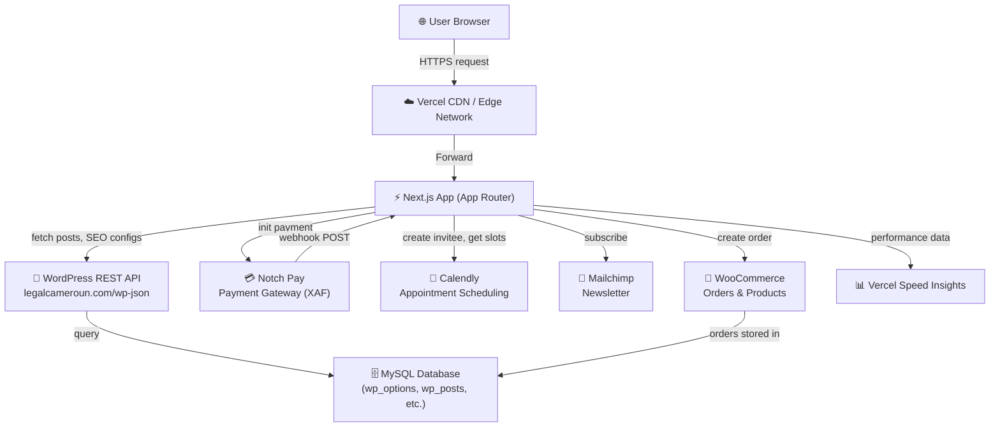

---

## 2. Tech Stack

| Layer | Technology | Version |
|---|---|---|
| Framework | Next.js (App Router) | 16.1.4 |
| UI library | React | 19.2.3 |
| Language | TypeScript (strict) | 5.x |
| Styling | Tailwind CSS 4 | 4.x |
| Animation | GSAP + ScrollTrigger | 3.14.2 |
| Animation | Anime.js | 4.3.1 |
| 3D / WebGL | Three.js | 0.182.0 |
| PDF generation | jsPDF | 4.0.0 |
| Scroll observer | react-intersection-observer | 10.0.2 |
| Performance monitoring | @vercel/speed-insights | 1.3.1 |
| Package manager | npm | — |
| Font | Inria Sans (local TTF) | — |

### CSS approach

Tailwind CSS 4 uses the new `@import "tailwindcss"` syntax in `globals.css` (no separate `tailwind.config.js` required). PostCSS is configured via `postcss.config.mjs` with the `@tailwindcss/postcss` plugin.

---

## 3. Architecture & Directory Structure

### 📁 Annotated Directory Tree

```
legal-cameroun/
├── app/                        # Next.js App Router root
│   ├── layout.tsx              # Root HTML layout, fonts, providers
│   ├── page.tsx                # Homepage (/)
│   ├── globals.css             # Global CSS, Tailwind theme, custom tokens
│   ├── sitemap.ts              # Auto-generated sitemap.xml
│   ├── robots.ts               # robots.txt configuration
│   ├── not-found.tsx           # Global 404 page
│   ├── api/                    # API Route handlers (server-side)
│   │   ├── availability/route.ts
│   │   ├── bookings/create/route.ts
│   │   ├── contact/route.ts
│   │   ├── devis/route.ts
│   │   ├── newsletter/subscribe/route.ts
│   │   └── webhooks/notch/route.ts
│   ├── a-propos/page.tsx       # About page
│   ├── actualite/              # Blog section
│   │   ├── page.tsx            # Post listing
│   │   ├── page/[num]/page.tsx # Pagination
│   │   └── [slug]/page.tsx     # Single post
│   ├── contact/page.tsx
│   ├── creation-entreprise/    # Business creation hub
│   │   ├── page.tsx
│   │   ├── sas/page.tsx
│   │   ├── sarl/page.tsx
│   │   ├── sarlu/page.tsx
│   │   └── association/page.tsx
│   ├── modification-entreprise/ # Business modification hub
│   │   ├── page.tsx
│   │   ├── dissolution/page.tsx
│   │   ├── transfert-siege/page.tsx
│   │   ├── sarl-vers-sas/page.tsx
│   │   └── sas-vers-sarl/page.tsx
│   ├── simulateurs/            # Tax calculators
│   │   ├── page.tsx
│   │   ├── tva/page.tsx
│   │   ├── is/page.tsx
│   │   └── salaire/page.tsx
│   ├── fiches-pratiques/       # Practical guides
│   │   ├── page.tsx
│   │   ├── immatriculation-avec-atom/page.tsx
│   │   ├── prix-des-transferts/page.tsx
│   │   ├── presentation-societe-etablissement/page.tsx
│   │   └── tutoriel-consultation/page.tsx
│   ├── devis/page.tsx          # Quote wizard
│   ├── prendre-un-rendez-vous/page.tsx  # Appointment booking
│   ├── mentions-legales/page.tsx
│   ├── politique-de-confidentialite/page.tsx
│   └── conditions-generales/page.tsx
│
├── components/                 # Reusable React components
│   ├── about/
│   ├── actualite/
│   ├── contact/
│   ├── creation/
│   ├── devis/
│   ├── fiches-pratiques/
│   ├── home/
│   ├── layout/                 # Header, Footer
│   ├── legal/
│   ├── modification/
│   ├── rdv/
│   ├── seo/                    # LanguageHtmlSetter
│   └── simulateurs/
│
├── contexts/                   # React Contexts (client-side state)
│   ├── LanguageContext.tsx     # FR/EN language switching
│   └── ThemeContext.tsx        # Dark/Light theme
│
├── hooks/
│   └── useGSAPAnimation.ts    # GSAP scroll animation hooks
│
├── lib/                        # Utilities, API clients, data
│   ├── wordpress.ts            # WordPress REST API client
│   ├── wordpress-utils.ts      # Post transformation helpers
│   ├── seo-utils.ts            # createPageMetadata() + mergeSEO()
│   ├── translations.ts         # FR/EN translation strings
│   ├── calendly.ts             # Calendly API client
│   ├── notch.ts                # Notch Pay payment client
│   ├── woocommerce.ts          # WooCommerce order client
│   ├── about-data.ts
│   ├── actualite-page-utils.ts
│   ├── contact-data.ts
│   ├── creation-data.ts
│   ├── modification-data.ts
│   ├── devis-data.ts
│   ├── fiches-pratiques-data.ts
│   ├── simulateurs-data.ts
│   └── translations/
│
├── public/                     # Static assets (fonts, icons, images)
│   ├── fonts/inria_sans/       # 6 TTF weight variants
│   ├── custom-icons/SVG/       # 55 service icons (× 2 variants)
│   ├── testimonials/           # Client photos
│   └── images/
│
├── lc-seo-manager/
│   └── lc-seo-manager.php      # WordPress SEO plugin (uploadable)
│
├── .vercel/project.json        # Main Vercel project config
├── .vercel.mike/project.json   # Alternate Vercel project config
├── .env.example                # Template for environment variables
├── CLAUDE.md                   # Claude Code instructions
├── IMPLEMENTATION.md           # Full implementation guide
├── next.config.ts
├── tsconfig.json
├── postcss.config.mjs
└── package.json
```

### Path alias

`@/*` maps to the project root (configured in `tsconfig.json`). Use `@/lib/wordpress` instead of relative paths.

### CSS design tokens

Defined in `app/globals.css` via Tailwind CSS 4 custom theme:

| Token | Color | Usage |
|---|---|---|
| Primary dark blue | `#0a3d4f` → `#26819b` | Main brand, headers, CTAs |
| Secondary gold | `#b89e7a` → `#cab393` | Accent, premium elements |
| Creation | `#0095bb` | Creation section highlight |
| Gestion / Modification | `#f39433` | Modification section |
| Accompagnement | `#83b02c` | Advisory/legal guidance |

---

### 📊 Provider Stack

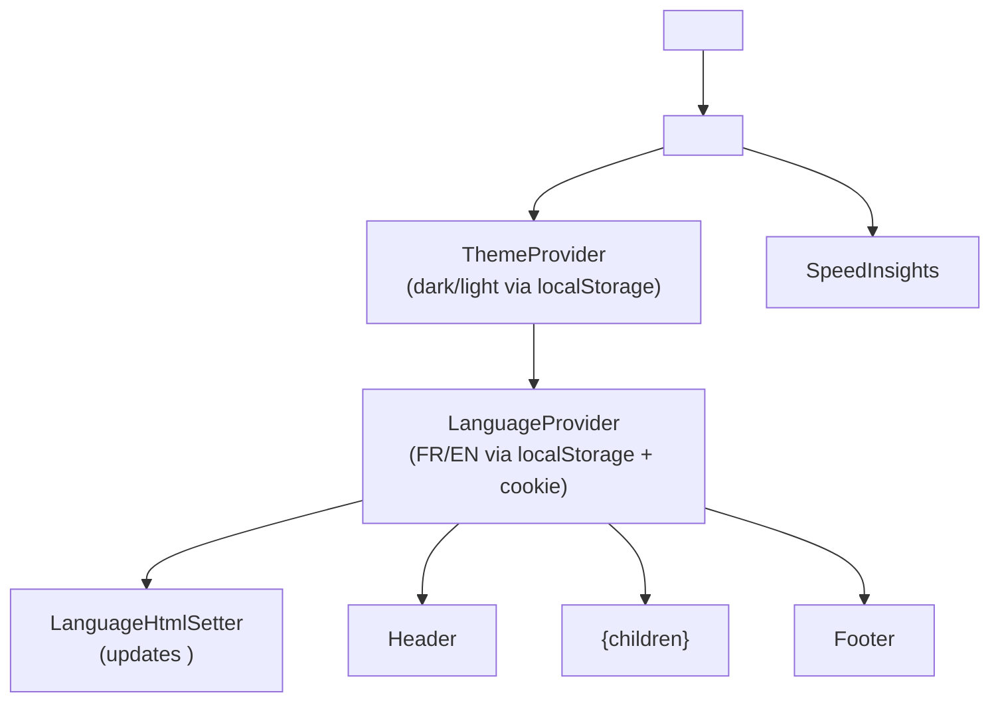

---

### 📊 Request Lifecycle

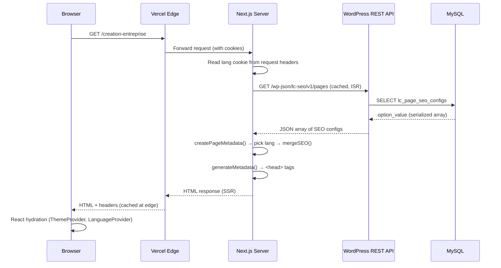

---

### 📊 App Routes Map

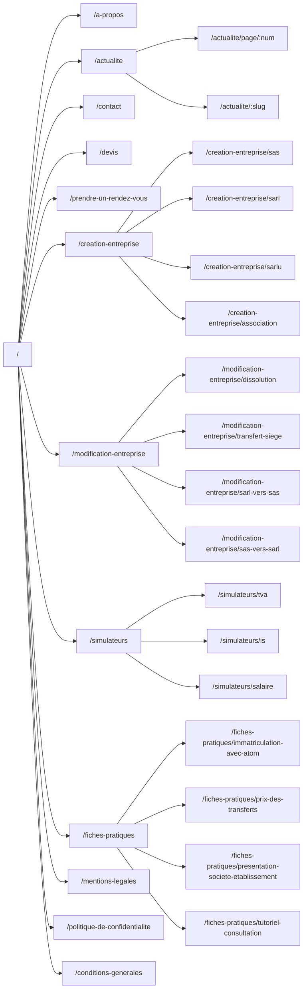

---

## 4. All Routes & Pages

### Page Routes

| URL | File | Description | Data source | `generateMetadata` |
|---|---|---|---|---|
| `/` | `app/page.tsx` | Homepage | WordPress (featured posts) | `createPageMetadata('/')` |
| `/a-propos` | `app/a-propos/page.tsx` | About page | Static data (`about-data.ts`) | `createPageMetadata('/a-propos')` |
| `/contact` | `app/contact/page.tsx` | Contact form | Static data | `createPageMetadata('/contact')` |
| `/devis` | `app/devis/page.tsx` | Quote wizard | Static data (`devis-data.ts`) | `createPageMetadata('/devis')` |
| `/prendre-un-rendez-vous` | `app/prendre-un-rendez-vous/page.tsx` | Booking form | Calendly API | `createPageMetadata('/prendre-un-rendez-vous')` |
| `/creation-entreprise` | `app/creation-entreprise/page.tsx` | Creation hub | Static (`creation-data.ts`) | `createPageMetadata('/creation-entreprise')` |
| `/creation-entreprise/sas` | `app/creation-entreprise/sas/page.tsx` | SAS creation | Static | `createPageMetadata('/creation-entreprise/sas')` |
| `/creation-entreprise/sarl` | `app/creation-entreprise/sarl/page.tsx` | SARL creation | Static | `createPageMetadata('/creation-entreprise/sarl')` |
| `/creation-entreprise/sarlu` | `app/creation-entreprise/sarlu/page.tsx` | SARLU creation | Static | `createPageMetadata('/creation-entreprise/sarlu')` |
| `/creation-entreprise/association` | `app/creation-entreprise/association/page.tsx` | Association | Static | `createPageMetadata('/creation-entreprise/association')` |
| `/modification-entreprise` | `app/modification-entreprise/page.tsx` | Modification hub | Static | `createPageMetadata('/modification-entreprise')` |
| `/modification-entreprise/dissolution` | `app/modification-entreprise/dissolution/page.tsx` | Dissolution | Static | `createPageMetadata(...)` |
| `/modification-entreprise/transfert-siege` | `app/modification-entreprise/transfert-siege/page.tsx` | HQ transfer | Static | `createPageMetadata(...)` |
| `/modification-entreprise/sarl-vers-sas` | `app/modification-entreprise/sarl-vers-sas/page.tsx` | SARL→SAS | Static | `createPageMetadata(...)` |
| `/modification-entreprise/sas-vers-sarl` | `app/modification-entreprise/sas-vers-sarl/page.tsx` | SAS→SARL | Static | `createPageMetadata(...)` |
| `/actualite` | `app/actualite/page.tsx` | Blog listing | WordPress posts | `createPageMetadata('/actualite')` |
| `/actualite/page/[num]` | `app/actualite/page/[num]/page.tsx` | Paginated blog | WordPress posts | Dynamic |
| `/actualite/[slug]` | `app/actualite/[slug]/page.tsx` | Single post | WordPress + comments | `generateMetadata` (from WP post) |
| `/simulateurs` | `app/simulateurs/page.tsx` | Calculators hub | Static | `createPageMetadata('/simulateurs')` |
| `/simulateurs/tva` | `app/simulateurs/tva/page.tsx` | TVA calculator | Static | `createPageMetadata('/simulateurs/tva')` |
| `/simulateurs/is` | `app/simulateurs/is/page.tsx` | IS calculator | Static | `createPageMetadata('/simulateurs/is')` |
| `/simulateurs/salaire` | `app/simulateurs/salaire/page.tsx` | Salary calculator | Static | `createPageMetadata('/simulateurs/salaire')` |
| `/fiches-pratiques` | `app/fiches-pratiques/page.tsx` | Guides hub | Static | `createPageMetadata('/fiches-pratiques')` |
| `/fiches-pratiques/immatriculation-avec-atom` | … | ATOM registration guide | Static | `createPageMetadata(...)` |
| `/fiches-pratiques/prix-des-transferts` | … | Transfer pricing guide | Static | `createPageMetadata(...)` |
| `/fiches-pratiques/presentation-societe-etablissement` | … | Company/branch guide | Static | `createPageMetadata(...)` |
| `/fiches-pratiques/tutoriel-consultation` | … | Consultation tutorial | Static | `createPageMetadata(...)` |
| `/mentions-legales` | `app/mentions-legales/page.tsx` | Legal notices | WordPress page | noindex |
| `/politique-de-confidentialite` | … | Privacy policy | WordPress page | noindex |
| `/conditions-generales` | … | Terms & conditions | WordPress page | noindex |

### API Routes

| URL | File | Purpose |
|---|---|---|
| `POST /api/contact` | `app/api/contact/route.ts` | Proxy contact form to WordPress CF7 |
| `POST /api/devis` | `app/api/devis/route.ts` | Proxy quote form to WordPress CF7 |
| `POST /api/bookings/create` | `app/api/bookings/create/route.ts` | Create Calendly invitee + WooCommerce order |
| `GET /api/availability` | `app/api/availability/route.ts` | Fetch available Calendly time slots |
| `POST /api/newsletter/subscribe` | `app/api/newsletter/subscribe/route.ts` | Subscribe email to Mailchimp list |
| `POST /api/webhooks/notch` | `app/api/webhooks/notch/route.ts` | Handle Notch Pay payment webhooks |

---

## 5. Components Catalog

### `components/layout/`
| Component | Description |
|---|---|
| `Header.tsx` | Site navigation, language switcher, dark/light toggle |
| `Footer.tsx` | Footer links, newsletter CTA, social links |

### `components/home/`
| Component | Description |
|---|---|
| `Hero.tsx` | Homepage hero with animated background |
| `Services.tsx` | Main service cards grid |
| `WhyChooseUs.tsx` | Benefits/differentiators section |
| `HowItWorks.tsx` | Step-by-step process |
| `Testimonials.tsx` | Client testimonials carousel |
| `Stats.tsx` | Animated key statistics counters |
| `BlogPreview.tsx` | Latest 3 blog posts from WordPress |
| `CTASection.tsx` | Bottom call-to-action banner |

### `components/about/`
| Component | Description |
|---|---|
| `AboutHero.tsx` | About page header |
| `AboutTimeline.tsx` | Company history timeline |
| `OfficesSection.tsx` | Office locations |
| `TestimonialsCarousel.tsx` | Client testimonials with photos |
| `ValuesGrid.tsx` | Company values grid |
| `WhoWeAre.tsx` | Team/mission section |

### `components/creation/`
| Component | Description |
|---|---|
| `CreationHero.tsx` | Section hero banner |
| `SubpagesGrid.tsx` | Grid of company-type cards |
| `SubpageLayout.tsx` | Shared layout for SAS/SARL/SARLU/Association pages |
| `ComparisonTable.tsx` | Side-by-side legal form comparison |
| `LegalFormsComparison.tsx` | Detailed comparison table |
| `PricingCards.tsx` | Service pricing cards |
| `StepsTimeline.tsx` | Formation process steps |
| `FAQSection.tsx` | Accordion FAQ |
| `AidesAvantages.tsx` | Benefits and incentives |
| `TrustBadges.tsx` | Trust indicators / certifications |
| `WhyChooseUsSection.tsx` | Section-specific benefits |

### `components/modification/`
| Component | Description |
|---|---|
| `ModificationTypesGrid.tsx` | Grid of modification type cards |
| `GestionTimeline.tsx` | Process timeline for modification |
| `GestionPricingCards.tsx` | Pricing for modification services |
| `GestionDocumentsChecklist.tsx` | Required documents checklist |
| `SocieteTypeTabs.tsx` | Tab switcher between company types |

### `components/actualite/`
| Component | Description |
|---|---|
| `ActualiteHero.tsx` | Blog section hero |
| `ActualiteGrid.tsx` | Post listing grid |
| `BlogPostCard.tsx` | Single post card (title, excerpt, category) |
| `PostContent.tsx` | Full post content renderer |
| `CommentsSection.tsx` | Comments listing and submission form |

### `components/simulateurs/`
| Component | Description |
|---|---|
| `SimulateursHero.tsx` | Calculators section hero |
| `SimulateursGrid.tsx` | Grid of calculator cards |
| `SimulateurCard.tsx` | Individual calculator card |
| `SimulateurPageTemplate.tsx` | Shared page wrapper for all calculators |
| `TVASimulator.tsx` | VAT calculator UI + logic |
| `ISSimulator.tsx` | Corporate tax calculator UI + logic |
| `SalaireSimulator.tsx` | Salary/payroll calculator UI + logic |

### `components/fiches-pratiques/`
| Component | Description |
|---|---|
| `FichesHero.tsx` | Guides section hero |
| `FichesGrid.tsx` | Grid of guide cards |
| `FichePageTemplate.tsx` | Shared template for individual guides |
| `FichesFooterCTA.tsx` | Bottom CTA banner for guides |

### `components/devis/`
| Component | Description |
|---|---|
| `DevisWizard.tsx` | Multi-step quote form wizard |
| `ProgressBar.tsx` | Step progress indicator |

### `components/contact/`
| Component | Description |
|---|---|
| `ContactHero.tsx` | Contact page hero |
| `ContactForm.tsx` | Contact form (proxied to WordPress CF7) |
| `ContactOffices.tsx` | Office addresses and maps |
| `UrgentContact.tsx` | Urgent contact phone/WhatsApp |
| `WhyContactUs.tsx` | Benefits of contacting |
| `ContactFinalCTA.tsx` | Bottom CTA |

### `components/rdv/`
| Component | Description |
|---|---|
| `BookingForm.tsx` | Appointment booking form (Calendly + WooCommerce) |

### `components/legal/`
| Component | Description |
|---|---|
| `LegalPageContent.tsx` | Renderer for WordPress-sourced legal pages |

### `components/seo/`
| Component | Description |
|---|---|
| `LanguageHtmlSetter.tsx` | Client component that updates `<html lang="">` reactively |

---

## 6. Lib Utilities Reference

### `lib/wordpress.ts` — WordPress REST API client

**Purpose:** All communication with the WordPress backend.

**Configuration:**
```ts
const WP_API_URL = `${process.env.WC_SITE_URL}/wp-json/wp/v2`
const WP_USERNAME = process.env.WC_SITE_APP_USERNAME
const WP_APP_PASSWORD = process.env.WC_SITE_APP_PASSWORD
// Auth: Basic base64(username:app_password)
```

**Exported functions:**

| Function | Returns | Description |
|---|---|---|
| `getPosts(params?)` | `WPPostsResponse` | Paginated post listing |
| `getPost(slug)` | `WPPost \| null` | Single post by slug |
| `getCategories()` | `WPCategory[]` | All categories |
| `getFeaturedPosts(count)` | `WPPost[]` | Latest N posts for homepage |
| `getRelatedPosts(id, cats, count)` | `WPPost[]` | Related posts by category |
| `getComments(postId)` | `WPComment[]` | Comments for a post |
| `getAllPagesSEO()` | `WPPageSEO[]` | All SEO configs from plugin |
| `isWordPressConfigured()` | `boolean` | Check env vars are set |

**ISR revalidation:** controlled by `WP_REVALIDATE_SECONDS` env var (default: 3600s).

---

### `lib/wordpress-utils.ts` — Post transformation helpers

| Function | Description |
|---|---|
| `decodeHtmlEntities(str)` | Decode HTML entities from WP content |
| `stripHtml(html)` | Strip all HTML tags |
| `calculateReadTime(content)` | Estimate read time (200 wpm) |
| `formatDate(dateStr)` | Format date as "1 janvier 2025" |
| `formatDateShort(dateStr)` | Short date format |
| `getRelativeTime(dateStr)` | "Il y a 2 jours" style |
| `transformPost(wpPost)` | Convert `WPPost` → app `Post` type |
| `transformPosts(wpPosts)` | Bulk transform array |
| `sanitizeContent(html)` | Remove dangerous HTML tags |
| `extractTableOfContents(html)` | Parse H2-H4 headings into TOC |
| `processPdfLinks(html)` | Inline PDF viewer for PDF links |
| `transformComments(wpComments)` | Flatten nested WP comments |
| `addHeadingIds(html)` | Add `id=""` to headings for anchors |

---

### `lib/seo-utils.ts` — SEO metadata pipeline

| Export | Description |
|---|---|
| `createPageMetadata(path, defaults)` | Main entry point — reads cookie/header → fetches WP configs → merges |
| `mergeSEO(defaults, wp, lang)` | Internal — overlay WP SEO config onto Next.js `Metadata` defaults |

Uses React `cache()` to ensure only one WordPress fetch per page render cycle.

---

### `lib/calendly.ts` — Calendly API client

| Function | Description |
|---|---|
| `createInvitee(data)` | Book an appointment slot |
| `getEventAvailability(userUri, eventTypeUri, start, end)` | Fetch available time slots |
| `getEventTypes(userUri)` | List all Calendly event types |

---

### `lib/notch.ts` — Notch Pay client

| Function | Description |
|---|---|
| `initializePayment(data)` | Create a Notch Pay payment session |
| `verifyPayment(reference)` | Verify payment status by reference |

---

### `lib/woocommerce.ts` — WooCommerce client

Creates orders for consultation bookings.

**Product IDs:**
- `CONSULTATION_PRODUCT_ID` — paid consultation product
- `FREE_CONSULTATION_PRODUCT_ID` — free consultation product

---

### `lib/translations.ts`

Exports `translations` object (type `Record<Language, Translations>`) with all FR/EN UI strings for navigation, hero text, services, FAQ, etc.

---

### `lib/simulateurs-data.ts`

Contains tax rate constants and formula logic for all three calculators. See [Section 15](#15-tax-calculators-reference) for rates.

---

### `hooks/useGSAPAnimation.ts`

| Hook | Description |
|---|---|
| `useScrollTrigger()` | Trigger GSAP animation when element enters viewport |
| `useStaggerAnimation()` | Stagger entrance animations on child elements |
| `useTimelineAnimation()` | Compose complex GSAP timelines |
| `useCounterAnimation()` | Count up numbers on scroll (for Stats section) |

All hooks register GSAP's `ScrollTrigger` plugin automatically.

---

## 7. Bilingual System (FR/EN)

The site supports French and English. Language state is managed client-side via `LanguageContext` and propagated to SSR via a `lang` cookie.

### Language detection flow

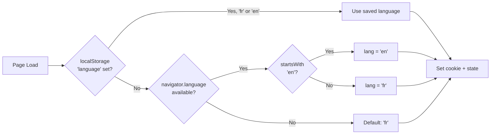

### Bilingual SSR flow

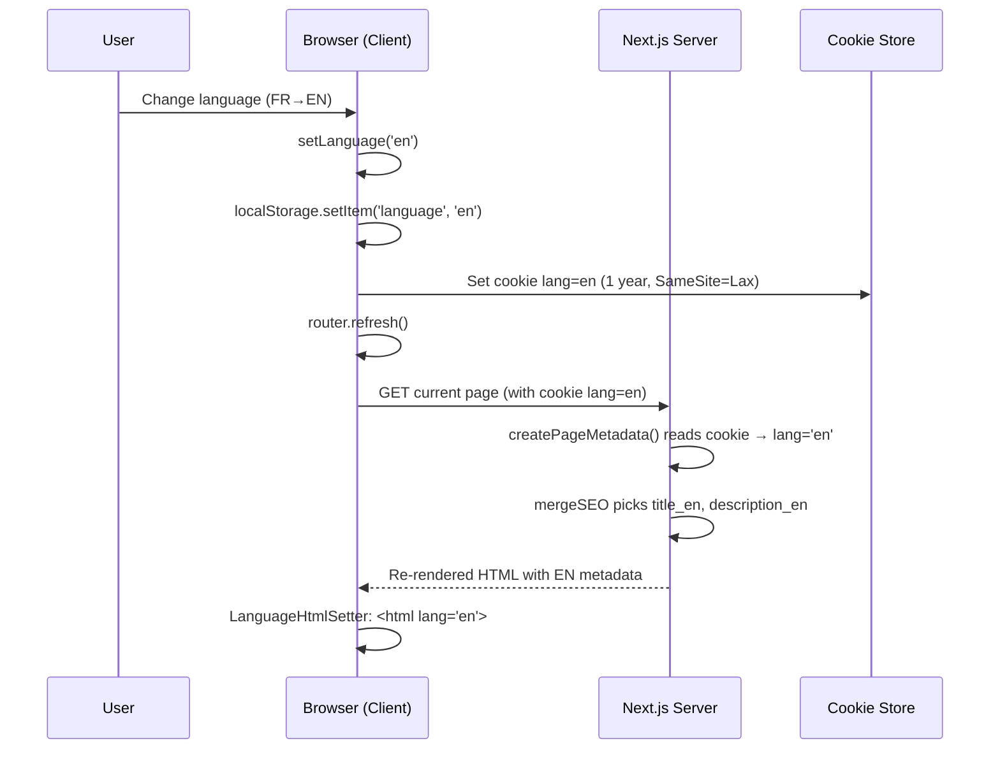

### Key files

| File | Role |
|---|---|
| `contexts/LanguageContext.tsx` | State management, `setLanguage()`, `useLanguage()` hook |
| `contexts/ThemeContext.tsx` | Dark/light state, `toggleTheme()`, `useTheme()` hook |
| `components/seo/LanguageHtmlSetter.tsx` | Syncs `<html lang="">` attribute reactively |
| `lib/translations.ts` | All UI strings in `{ fr: {...}, en: {...} }` shape |

### Hydration safety

Both `LanguageProvider` and `ThemeProvider` render with default values (`'fr'` / `'light'`) during SSR to prevent hydration mismatches. They detect actual preferences in a `useEffect` after mounting.

---

## 8. SEO System

### SEO metadata pipeline

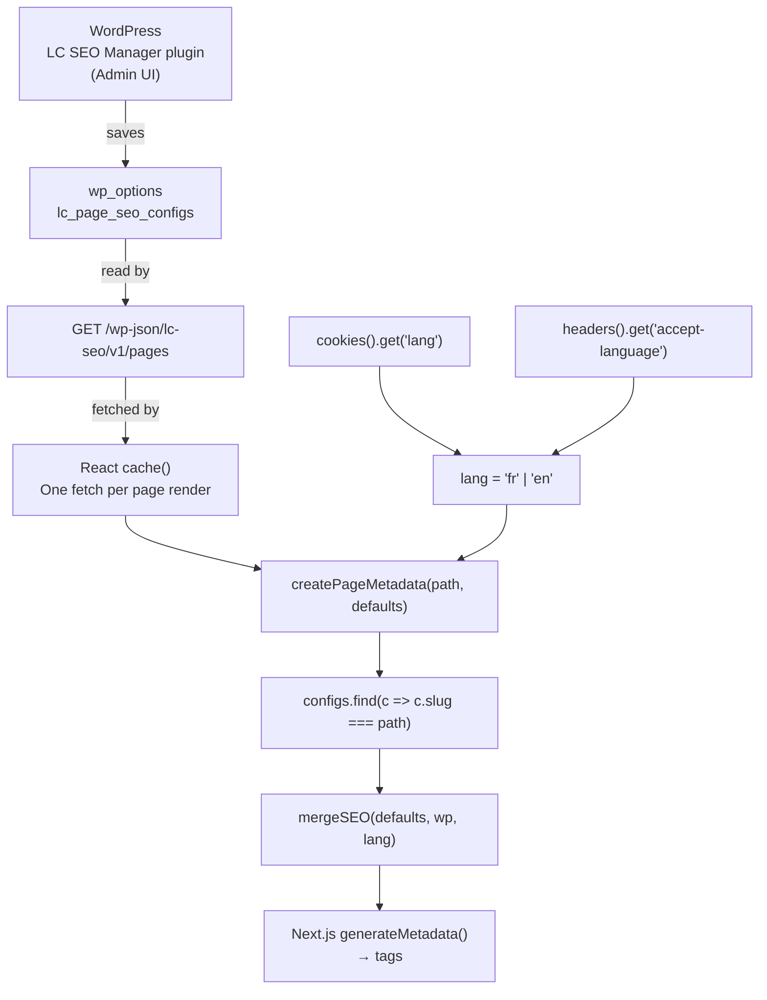

### Language detection for SSR (server-side)

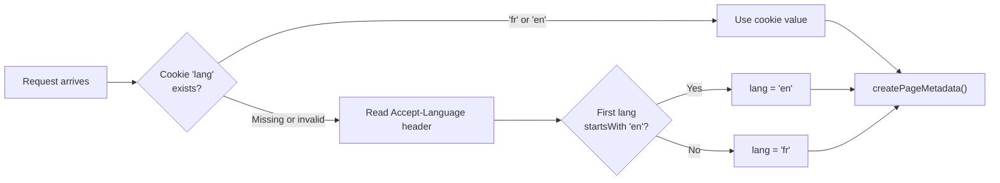

### SEO fields reference

All 25 fields stored per page config in `wp_options.lc_page_seo_configs`:

| Field | EN variant | Type | Description |
|---|---|---|---|
| `slug` | — | string | Next.js route path (e.g., `/creation-entreprise`) |
| `name` | — | string | Human-friendly label |
| `title` | `title_en` | string | `<title>` tag |
| `description` | `description_en` | string | `<meta name="description">` |
| `keywords` | `keywords_en` | string | `<meta name="keywords">` |
| `canonical` | — | url | `<link rel="canonical">` |
| `robots` | — | string | `<meta name="robots">` (e.g., `noindex,nofollow`) |
| `og_title` | `og_title_en` | string | `<meta property="og:title">` |
| `og_description` | `og_description_en` | string | `<meta property="og:description">` |
| `og_type` | — | string | `<meta property="og:type">` |
| `og_image` | — | url | `<meta property="og:image">` |
| `og_image_width` | — | int | OG image width in px |
| `og_image_height` | — | int | OG image height in px |
| `og_image_alt` | `og_image_alt_en` | string | OG image alt text |
| `twitter_card` | — | string | `summary_large_image` / `summary` |
| `twitter_title` | `twitter_title_en` | string | Twitter card title |
| `twitter_description` | `twitter_description_en` | string | Twitter card description |
| `twitter_image` | — | url | Twitter card image |

### Sitemap priorities

Defined in `app/sitemap.ts`:

| URL | Priority | Change Frequency |
|---|---|---|
| `/` | 1.0 | daily |
| `/creation-entreprise` | 0.9 | weekly |
| `/modification-entreprise` | 0.9 | weekly |
| `/creation-entreprise/sas` | 0.8 | weekly |
| `/creation-entreprise/sarl` | 0.8 | weekly |
| `/creation-entreprise/sarlu` | 0.8 | weekly |
| `/creation-entreprise/association` | 0.8 | weekly |
| `/modification-entreprise/*` (4 routes) | 0.8 | weekly |
| `/actualite` | 0.8 | daily |
| `/simulateurs` + `/simulateurs/*` (3) | 0.7 | monthly |
| `/fiches-pratiques` + sub-pages (4) | 0.7 | monthly |
| `/a-propos`, `/contact`, `/devis`, `/prendre-un-rendez-vous` | 0.7 | monthly |
| `/mentions-legales`, `/politique-de-confidentialite`, `/conditions-generales` | 0.3 | monthly |

### robots.ts

```
Allow: /
Sitemap: https://legalcameroun.com/sitemap.xml
```

### JSON-LD on blog posts

Individual blog post pages (`/actualite/[slug]`) include a JSON-LD `Article` schema with `headline`, `author`, `datePublished`, `dateModified`, and `image` fields populated from WordPress post data.

---

## 9. WordPress Integration

### Base configuration

```
WC_SITE_URL     = https://legalcameroun.com   (WordPress root)
WP_API_URL      = ${WC_SITE_URL}/wp-json/wp/v2
SEO_API_URL     = ${WC_SITE_URL}/wp-json/lc-seo/v1
```

### Authentication

WordPress Application Password authentication:
```
Authorization: Basic base64(WC_SITE_APP_USERNAME:WC_SITE_APP_PASSWORD)
```

### REST endpoints consumed

| Endpoint | Method | Purpose | Auth required |
|---|---|---|---|
| `/wp-json/wp/v2/posts` | GET | Post listing with pagination | No |
| `/wp-json/wp/v2/posts?slug={slug}` | GET | Single post lookup | No |
| `/wp-json/wp/v2/categories` | GET | Category list | No |
| `/wp-json/wp/v2/comments?post={id}` | GET | Post comments | No |
| `/wp-json/wp/v2/pages?slug={slug}` | GET | WordPress pages (legal content) | No |
| `/wp-json/lc-seo/v1/pages` | GET | All SEO configs | No (public) |
| `/wp-json/lc-seo/v1/pages` | POST | Create/update SEO config | Yes (admin) |
| `/wp-json/lc-seo/v1/pages/{slug}` | DELETE | Delete SEO config | Yes (admin) |

### ISR (Incremental Static Regeneration)

Pages fetching WordPress data use `next: { revalidate: WP_REVALIDATE_SECONDS }` (default `3600` = 1 hour). This means:
- Content appears on the site within ~1 hour after publishing in WordPress
- To force immediate refresh: trigger a manual revalidation or redeploy on Vercel

### Image domains

WordPress-hosted images are allowed in `next.config.ts`:
```
legalcameroun.com/wp-content/uploads/**
www.legalcameroun.com/wp-content/uploads/**
live.legalcameroun.com/wp-content/uploads/**
staging.legalcameroun.com/wp-content/uploads/**
secure.gravatar.com  (author avatars)
```

---

### Blog Post Data Flow

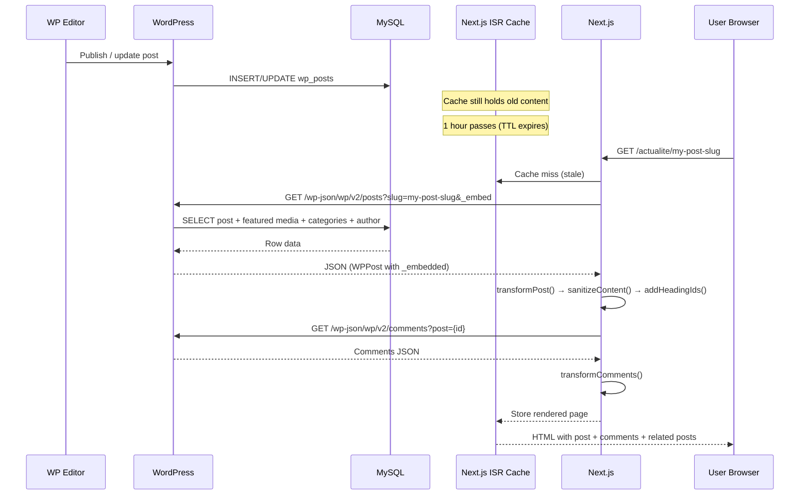

---

## 10. WordPress Plugin — LC SEO Manager

### Installation

1. Locate the plugin at `lc-seo-manager/lc-seo-manager.php` in this repository
2. Create a ZIP: `zip -r lc-seo-manager.zip lc-seo-manager/`
3. In WordPress Admin: **Plugins → Add New → Upload Plugin**
4. Select the ZIP file, click **Install Now**, then **Activate**

### Admin UI location

**WordPress Admin → LC SEO** (left sidebar, icon: magnifier, position 80)

Sub-pages:
- **Toutes les configs** — list all configured pages
- **Nouvelle page SEO** — add or edit a page SEO config

### How to add/edit a page SEO config

1. Go to **WP Admin → LC SEO → Nouvelle page SEO**
2. **Slug (chemin Next.js):** Select the path from the dropdown (e.g., `/creation-entreprise/sas`) or type a custom one
3. **Nom affiché:** A label for your reference (e.g., "Création SAS")
4. Fill in **Balises de base** (French): Title, Description, Keywords, Canonical, Robots directive
5. Fill in **Open Graph** fields + upload OG image from media library
6. Fill in **Twitter Card** fields
7. Fill in **English overrides** (title_en, description_en, etc.) for bilingual SEO
8. Click **Enregistrer**

### How to delete a config

From the **Toutes les configs** list, click **Supprimer** next to the entry.

### REST API endpoints

| Method | Endpoint | Auth | Description |
|---|---|---|---|
| `GET` | `/wp-json/lc-seo/v1/pages` | Public | Returns all page SEO configs as JSON array |
| `POST` | `/wp-json/lc-seo/v1/pages` | `manage_options` | Create or update a config (by slug) |
| `DELETE` | `/wp-json/lc-seo/v1/pages/{slug}` | `manage_options` | Delete a config by slug |

> **Note:** Slug path separators (`/`) are allowed in the DELETE route via the regex `[a-zA-Z0-9_\-\/]+`.

### Storage details

All SEO configs are stored in a single WordPress option:

```
wp_options.option_name = 'lc_page_seo_configs'
wp_options.option_value = serialized PHP array, keyed by slug
```

**Direct DB inspection:**
```sql
SELECT option_value FROM wp_options WHERE option_name = 'lc_page_seo_configs';
```

### Known paths

The plugin includes a hardcoded list of 29 known paths for the dropdown:

```
/ /a-propos /actualite /contact /devis
/creation-entreprise /creation-entreprise/sarl /creation-entreprise/sarlu
/creation-entreprise/sas /creation-entreprise/association
/modification-entreprise /modification-entreprise/dissolution
/modification-entreprise/sarl-vers-sas /modification-entreprise/sas-vers-sarl
/modification-entreprise/transfert-siege
/fiches-pratiques /fiches-pratiques/immatriculation-avec-atom
/fiches-pratiques/presentation-societe-etablissement
/fiches-pratiques/prix-des-transferts /fiches-pratiques/tutoriel-consultation
/simulateurs /simulateurs/is /simulateurs/salaire /simulateurs/tva
/prendre-un-rendez-vous
/mentions-legales /politique-de-confidentialite /conditions-generales
```

---

## 11. Third-Party Integrations

### 📊 Integration Map

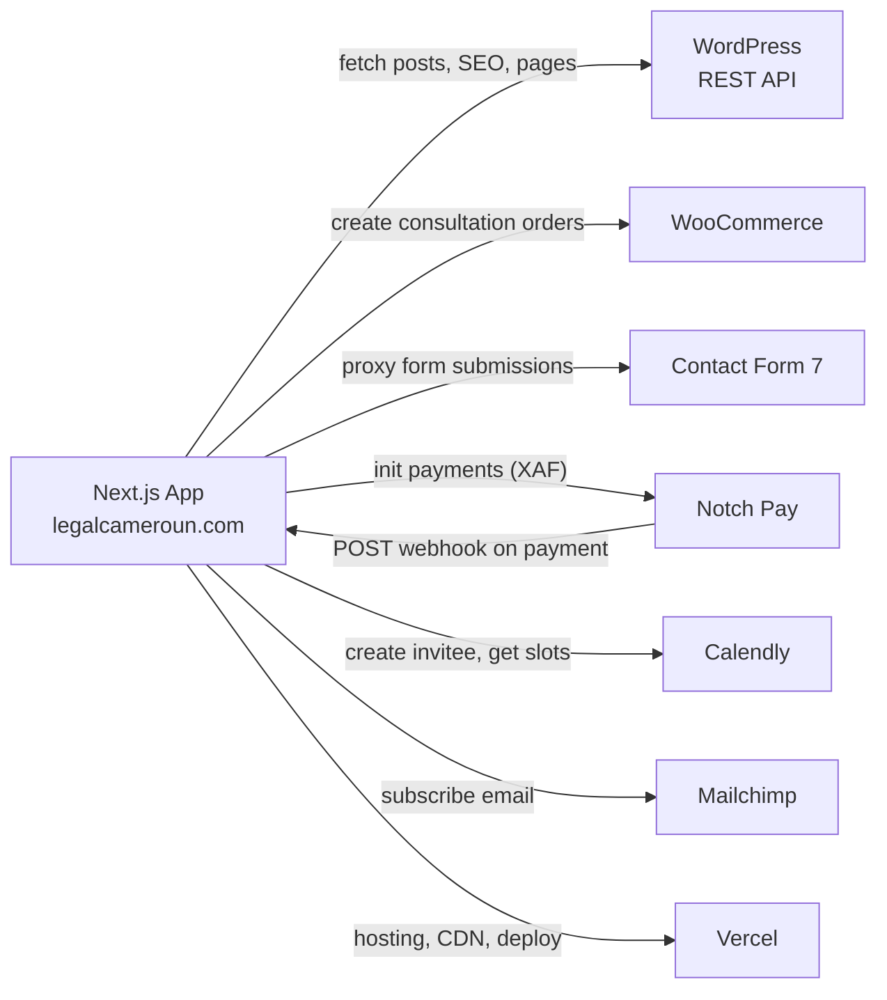

---

### WordPress REST API

**Purpose:** Headless CMS for blog posts, editorial content, legal page content, and SEO configuration.

**Env vars:** `WC_SITE_URL`, `WC_SITE_APP_USERNAME`, `WC_SITE_APP_PASSWORD`

**Used in:** `lib/wordpress.ts`

**Troubleshooting:**
- Verify `WC_SITE_URL` has no trailing slash
- Application Password must be generated from **WP Admin → Users → Profile → Application Passwords**
- Test: `curl -H "Authorization: Basic <base64>" https://legalcameroun.com/wp-json/wp/v2/posts`

---

### WooCommerce

**Purpose:** Creates orders for consultation bookings (paid and free). Each booking creates a WooCommerce order associated with the consultation product.

**Env vars:** `WC_CONSUMER_KEY`, `WC_CONSUMER_SECRET`, `CONSULTATION_PRODUCT_ID`, `FREE_CONSULTATION_PRODUCT_ID`

**Known product IDs (production):**
- Paid consultation: `1873`
- Free consultation: `1950`

**Used in:** `lib/woocommerce.ts`, `app/api/bookings/create/route.ts`

**Admin:** WP Admin → WooCommerce → Orders

---

### Contact Form 7

**Purpose:** WordPress plugin handling contact and devis form submissions. The Next.js API routes proxy form data to CF7 via the WordPress REST API.

**Env vars:** `WC_SITE_APP_CONTACT_FORM_7_ID`, `WC_SITE_APP_CONTACT_FORM_7_DEVIS_FORM_ID`

**Used in:** `app/api/contact/route.ts`, `app/api/devis/route.ts`

**Admin:** WP Admin → Contact → Contact Forms (note the form ID number shown next to each form)

---

### Notch Pay

**Purpose:** Payment gateway for the Cameroonian market. Handles payments in XAF/FCFA.

**Env vars:** `NOTCH_PUBLIC_KEY`, `NOTCH_PRIVATE_KEY`, `NOTCH_HASH_KEY`

**Webhook:** `POST /api/webhooks/notch` — Notch Pay calls this after payment confirmation

**Used in:** `lib/notch.ts`, `app/api/webhooks/notch/route.ts`

**Admin dashboard:** https://business.notchpay.co

#### Payment Flow

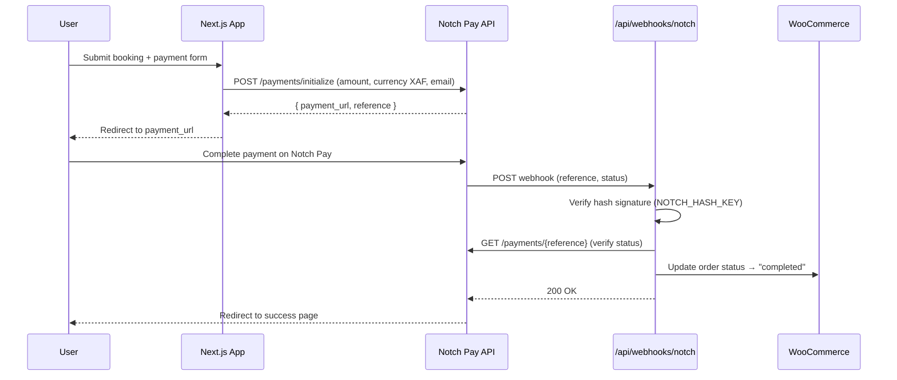

**Troubleshooting:**
- For local dev: use ngrok and set `NGROK_URL` so Notch Pay can reach your local webhook
- In production: webhook URL must be configured in Notch Pay dashboard as `https://legalcameroun.com/api/webhooks/notch`
- Hash validation uses `NOTCH_HASH_KEY` — ensure this matches the key in Notch Pay dashboard

---

### Calendly

**Purpose:** Appointment scheduling for consultations. Two event types: paid and free.

**Env vars:** `CALENDLY_PAT`, `CALENDLY_EVENT_URI`, `FREE_CALENDLY_EVENT_URI`

**Used in:** `lib/calendly.ts`, `app/api/bookings/create/route.ts`, `app/api/availability/route.ts`

**Admin dashboard:** https://calendly.com/app/scheduled_events

#### Booking Flow

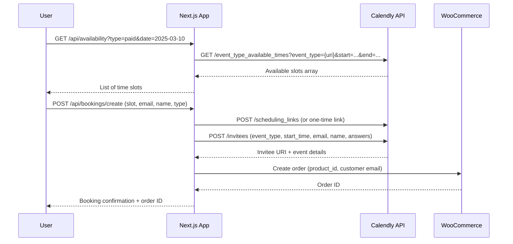

**Troubleshooting:**
- `CALENDLY_PAT` is a Personal Access Token from Calendly → Account → Integrations → API & Webhooks
- `CALENDLY_EVENT_URI` and `FREE_CALENDLY_EVENT_URI` are the full URIs (e.g., `https://api.calendly.com/event_types/XXXX`). Get these from the Calendly API or dashboard
- If event URIs change after editing event types, update env vars and redeploy

---

### Mailchimp

**Purpose:** Newsletter subscription list management.

**Env vars:** `MAILCHIMP_API_KEY`, `MAILCHIMP_LIST_ID`, `MAILCHIMP_SERVER_PREFIX`

**Used in:** `app/api/newsletter/subscribe/route.ts`

**Admin dashboard:** https://mailchimp.com (Audience → All contacts)

**How to get credentials:**
- `MAILCHIMP_API_KEY`: Account → Profile → Extras → API Keys → Create A Key
- `MAILCHIMP_LIST_ID`: Audience → All contacts → Settings → Audience ID
- `MAILCHIMP_SERVER_PREFIX`: The prefix in your Mailchimp URL (e.g., `us21` from `us21.admin.mailchimp.com`)

---

### Vercel

**Purpose:** Hosting, global CDN, serverless functions, automatic deployments.

**Projects:**

| Profile | Project ID | Org ID |
|---|---|---|
| Main (default) | `prj_rPBGxzrquUAoSTCSZsYuafsGrYxV` | `team_Efd0zlD22K4i73jS0bb8BUku` |
| Mike (alternate) | `prj_j5zCfOtFlalLAfRlVDJmiaoPLVsz` | `team_Nh4rhIeJxBOWWubPrWLFxbnl` |

See [Section 13](#13-deployment) for switching between projects.

---

## 12. Environment Variables — Complete Reference

All variables defined in `.env.example`. Copy to `.env.local` for development.

| Variable | Required | Default | Description | Used in |
|---|---|---|---|---|
| `WC_SITE_URL` | ✅ | — | WordPress site root URL (no trailing slash) | `lib/wordpress.ts`, `lib/woocommerce.ts` |
| `WC_SITE_APP_USERNAME` | ✅ | — | WordPress application password username | `lib/wordpress.ts` |
| `WC_SITE_APP_PASSWORD` | ✅ | — | WordPress application password value | `lib/wordpress.ts` |
| `WC_CONSUMER_KEY` | ✅ | — | WooCommerce REST API consumer key | `lib/woocommerce.ts` |
| `WC_CONSUMER_SECRET` | ✅ | — | WooCommerce REST API consumer secret | `lib/woocommerce.ts` |
| `CONSULTATION_PRODUCT_ID` | ✅ | `1873` | WooCommerce product ID for paid consultation | `lib/woocommerce.ts` |
| `FREE_CONSULTATION_PRODUCT_ID` | ✅ | `1950` | WooCommerce product ID for free consultation | `lib/woocommerce.ts` |
| `WC_SITE_APP_CONTACT_FORM_7_ID` | ✅ | — | CF7 form ID for contact form | `app/api/contact/route.ts` |
| `WC_SITE_APP_CONTACT_FORM_7_DEVIS_FORM_ID` | ✅ | — | CF7 form ID for devis form | `app/api/devis/route.ts` |
| `NOTCH_PUBLIC_KEY` | ✅ | — | Notch Pay public API key | `lib/notch.ts` |
| `NOTCH_PRIVATE_KEY` | ✅ | — | Notch Pay private API key | `lib/notch.ts` |
| `NOTCH_HASH_KEY` | ✅ | — | Notch Pay webhook hash verification key | `app/api/webhooks/notch/route.ts` |
| `CALENDLY_PAT` | ✅ | — | Calendly Personal Access Token | `lib/calendly.ts` |
| `CALENDLY_EVENT_URI` | ✅ | — | Calendly URI for paid consultation event type | `lib/calendly.ts` |
| `FREE_CALENDLY_EVENT_URI` | ✅ | — | Calendly URI for free consultation event type | `lib/calendly.ts` |
| `MAILCHIMP_API_KEY` | ✅ | — | Mailchimp API key | `app/api/newsletter/subscribe/route.ts` |
| `MAILCHIMP_LIST_ID` | ✅ | — | Mailchimp audience/list ID | `app/api/newsletter/subscribe/route.ts` |
| `MAILCHIMP_SERVER_PREFIX` | ✅ | — | Mailchimp server prefix (e.g., `us21`) | `app/api/newsletter/subscribe/route.ts` |
| `Frontend_SITE_URL` | ⚠️ | `https://legalcameroun.com` | Next.js site URL (for metadata base) | `app/layout.tsx` |
| `NGROK_URL` | Dev only | — | ngrok tunnel URL for local webhook testing | `app/api/webhooks/notch/route.ts` |
| `WP_REVALIDATE_SECONDS` | ⚠️ | `3600` | WordPress ISR cache TTL in seconds | `lib/wordpress.ts` |

> **🔑 Security note:** Never commit `.env.local`, `.env.development`, or `.env.production` to git. The `.gitignore` excludes these files. Only `.env.example` (with empty values) should be committed.

---

## 13. Deployment

### Vercel deployment

The project is deployed on Vercel with continuous deployment from the `main` branch.

**Build command:** `npm run build`
**Output directory:** `.next` (automatic for Next.js)
**Node.js version:** 20.x (Vercel default)

### Switching between Vercel projects

The project has two Vercel configurations:

```bash
# Use main project (default)
cp -r .vercel.main/ .vercel/   # if you have .vercel.main saved

# Use Mike's project
cp -r .vercel.mike/ .vercel/
```

> **Note:** `.vercel/` is gitignored. The alternate config is stored in `.vercel.mike/`.

### Environment variables on Vercel

1. Open Vercel dashboard → your project → **Settings → Environment Variables**
2. Add all variables from [Section 12](#12-environment-variables--complete-reference)
3. Set scope: **Production**, **Preview**, or **Development** as appropriate
4. Sensitive keys (`NOTCH_PRIVATE_KEY`, `WC_SITE_APP_PASSWORD`, etc.) should be **Production-only**

### ISR (Incremental Static Regeneration)

- WordPress-backed pages revalidate every `WP_REVALIDATE_SECONDS` (default 3600s = 1 hour)
- To force immediate revalidation: **Vercel Dashboard → Deployments → Redeploy** (uses `force: true`)
- The Vercel free tier supports ISR natively

### Local development

```bash
# Install dependencies
npm install

# Start dev server (http://localhost:3000)
npm run dev

# Build for production
npm run build

# Start production server locally
npm run start

# Run linter
npm run lint
```

For webhook testing locally:
```bash
# Install ngrok
ngrok http 3000
# Set NGROK_URL=https://xxxx.ngrok.io in .env.local
```

---

## 14. Site Administration Guide

This section is for non-developers managing the site.

### WordPress content

#### Publishing a blog post

1. Log in to **WordPress Admin** (`https://legalcameroun.com/wp-admin`)
2. Go to **Posts → Add New**
3. Write your post, assign a category, add a featured image
4. Click **Publish**
5. The post will appear on `legalcameroun.com/actualite` within **up to 1 hour** (ISR cache)

> **Note:** If you need the post live immediately, ask the developer to trigger a Vercel revalidation or redeploy.

#### Editing legal pages (Mentions légales, CGU, etc.)

1. Go to **WP Admin → Pages**
2. Find the page by its slug (e.g., `mentions-legales`)
3. Edit content and click **Update**
4. Changes appear on the site within ~1 hour

---

### SEO management (LC SEO Manager plugin)

#### Setting up SEO for a page

1. Go to **WP Admin → LC SEO → Nouvelle page SEO**
2. Choose the page slug from the dropdown (e.g., `/creation-entreprise/sas`)
3. Fill in **Title** (50–60 characters), **Description** (150–160 characters), **Keywords**
4. Upload an **OG Image** (1200×630px recommended) via **Choisir depuis la médiathèque**
5. Fill in **English overrides** for bilingual visitors
6. Click **Enregistrer**

#### Which slug to use for each URL

| Frontend URL | Slug to use |
|---|---|
| `legalcameroun.com/` | `/` |
| `legalcameroun.com/a-propos` | `/a-propos` |
| `legalcameroun.com/creation-entreprise/sas` | `/creation-entreprise/sas` |
| (etc.) | (same as URL path) |

> **Important:** The slug must exactly match the URL path, including the leading slash.

---

### Calendly management

1. Log in to **Calendly** (https://calendly.com)
2. Two event types are used:
   - **Paid consultation** — URI stored in `CALENDLY_EVENT_URI`
   - **Free consultation** — URI stored in `FREE_CALENDLY_EVENT_URI`
3. When you edit or recreate an event type, its URI changes. You must update the corresponding Vercel environment variable and **redeploy** the application.

---

### Notch Pay webhook

**Production webhook URL:** `https://legalcameroun.com/api/webhooks/notch`

1. Log in to **Notch Pay Business** (https://business.notchpay.co)
2. Go to **Settings → Webhooks**
3. Ensure the webhook URL is set to `https://legalcameroun.com/api/webhooks/notch`
4. The hash key must match `NOTCH_HASH_KEY` in Vercel environment variables

**For local development:** Set `NGROK_URL=https://xxxx.ngrok.io` in `.env.local` and use `https://xxxx.ngrok.io/api/webhooks/notch` in Notch Pay settings.

---

### Mailchimp setup

1. Log in to **Mailchimp** (https://mailchimp.com)
2. Go to **Audience → All contacts → Settings → Audience ID** → copy your list ID
3. Go to **Account → Profile → Extras → API Keys** → create or copy API key
4. Your server prefix is the subdomain in the Mailchimp dashboard URL (e.g., `us21`)
5. Update `MAILCHIMP_LIST_ID`, `MAILCHIMP_API_KEY`, `MAILCHIMP_SERVER_PREFIX` in Vercel

---

## 15. Tax Calculators Reference

All calculators are based on Cameroonian tax law (CGI 2024 + CNPS 2024).

### TVA (Value Added Tax)

| Parameter | Value |
|---|---|
| Standard rate | **19.25%** |
| Formula (HT → TTC) | `TTC = HT × 1.1925` |
| Formula (TTC → HT) | `HT = TTC / 1.1925` |
| TVA amount | `TVA = HT × 0.1925` |

Component: `components/simulateurs/TVASimulator.tsx`

---

### IS (Impôt sur les Sociétés — Corporate Income Tax)

| Revenue bracket | Rate |
|---|---|
| ≤ 3 billion FCFA annual revenue | **28.5%** |
| > 3 billion FCFA annual revenue | **33%** |

**Minimum tax:** 1% of turnover (minimum `222 000 FCFA`, maximum `2 777 000 FCFA`)

Component: `components/simulateurs/ISSimulator.tsx`

---

### Salaire (Payroll / Salary) Calculator

Based on CGI 2024 + CNPS 2024 contribution rates:

**Employee contributions (deducted from gross salary):**

| Contribution | Rate | Base |
|---|---|---|
| CNPS Vieillesse (pension) | 2.8% | Gross salary |
| IRPP (income tax) | Progressive (0–35%) | Net taxable income after deductions |

**Employer contributions (on top of gross salary):**

| Contribution | Rate | Base |
|---|---|---|
| CNPS AT/MP (work accidents) | 1.75% – 5% (sector-dependent) | Gross salary |
| CNPS Allocations familiales | 7% | Gross salary |
| CNPS Vieillesse (employer part) | 4.2% | Gross salary |
| TDL (Tax on salaries) | 1% | Gross salary |
| RAV (Redevance audio-visuelle) | Fixed | Per employee |
| FNE (Employment fund) | 1% | Gross salary |

**IRPP progressive brackets (monthly taxable income):**

| Bracket (FCFA/month) | Rate |
|---|---|
| 0 – 62 000 | 0% |
| 62 001 – 310 000 | 11% |
| 310 001 – 1 035 000 | 16.5% |
| > 1 035 000 | 35% |

Component: `components/simulateurs/SalaireSimulator.tsx`

---

## 16. Public Assets Reference

### Custom icons

Located at: `public/custom-icons/SVG/`

55 service icons, each available in 2 variants:
- **BICHROME** — two-color (blue + orange)
- **Bleue** — single blue color

Icon categories include: accounting, legal, tax, business registration, compliance, consulting, etc.

### Fonts

Located at: `public/fonts/inria_sans/`

| File | Weight | Style |
|---|---|---|
| `InriaSans-Light.ttf` | 300 | normal |
| `InriaSans-LightItalic.ttf` | 300 | italic |
| `InriaSans-Regular.ttf` | 400 | normal |
| `InriaSans-Italic.ttf` | 400 | italic |
| `InriaSans-Bold.ttf` | 700 | normal |
| `InriaSans-BoldItalic.ttf` | 700 | italic |

Loaded via Next.js `localFont()` in `app/layout.tsx` as the CSS variable `--font-inria-sans`.

### Testimonial images

Located at: `public/testimonials/`

4 named client photos used in the `TestimonialsCarousel` and `Testimonials` components.

### Blog placeholder

`public/images/blog-placeholder.svg` — fallback image when a WordPress post has no featured image.

---

*End of Legal Cameroun Technical Handbook — v1.0.0 — 2026-03-09*
